---
## Front matter
lang: ru-RU
title: Презентация по лабораторной работе №1
subtitle: Установка и конфигурация операционной системы на виртуальную машину
author:
  - Танрибергенов Э.
institute:
  - Российский университет дружбы народов, Москва, Россия
date: 2024 г.

## i18n babel
babel-lang: russian
babel-otherlangs: english
## Fonts
mainfont: IBM Plex Serif
romanfont: IBM Plex Serif
sansfont: IBM Plex Sans
monofont: IBM Plex Mono
mathfont: STIX Two Math
mainfontoptions: Ligatures=Common,Ligatures=TeX,Scale=0.94
romanfontoptions: Ligatures=Common,Ligatures=TeX,Scale=0.94
sansfontoptions: Ligatures=Common,Ligatures=TeX,Scale=MatchLowercase,Scale=0.94
monofontoptions: Scale=MatchLowercase,Scale=0.94,FakeStretch=0.9
## Formatting pdf
toc: false
toc-title: Содержание
slide_level: 2
aspectratio: 169
section-titles: true
theme: metropolis
header-includes:
 - \metroset{progressbar=frametitle,sectionpage=progressbar,numbering=fraction}
---

# Информация

## Докладчик

  - Танрибергенов Эльдар
  - студент 4 курса из группы НПИбд-02-21
  - ФМиЕН, кафедра прикладной информатики и теории вероятностей
  - Российский университет дружбы народов

# Цели и задачи

## Цель работы

Целью данной работы является приобретение практических навыков установки операционной системы на виртуальную машину, настройки минимально необходимых для дальнейшей работы сервисов.
А также создание репозитория на Github для отчётности.

## Задачи

1. Установить ОС на виртуальную машину
2. Получить информацию о системе в терминале
3. Создать репозиторий на github

# Результаты

## Установка ОС на виртуальную машину

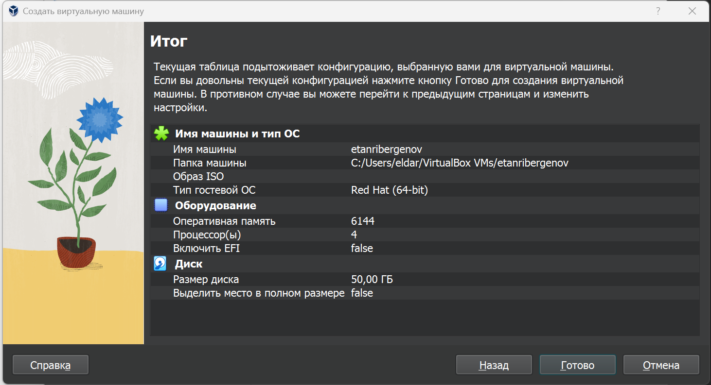{#fig:001 width=70% height=70%}

## Установка ОС на виртуальную машину

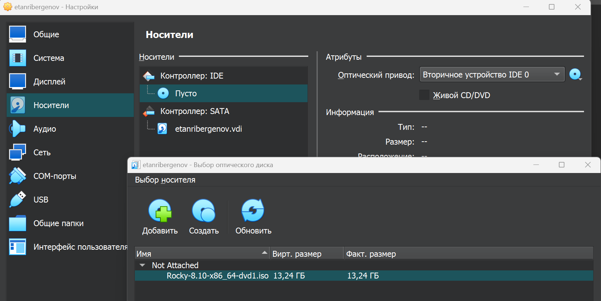{#fig:002 width=80% height=80%}

## Установка ОС на виртуальную машину

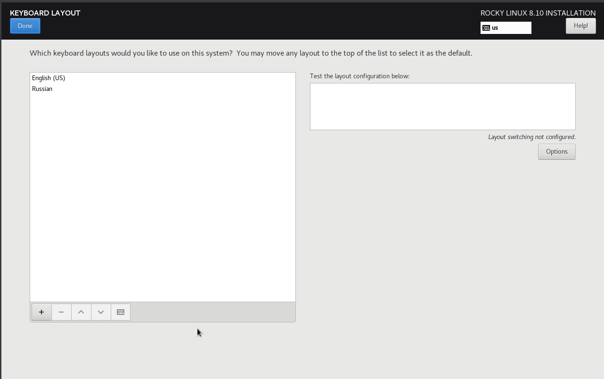{#fig:003 width=70% height=70%}

## Установка ОС на виртуальную машину

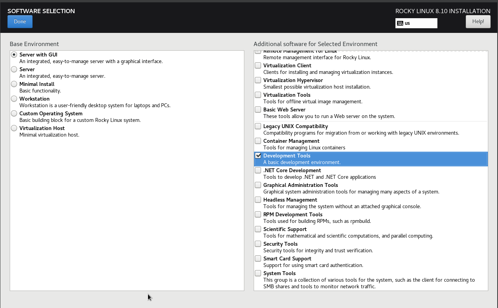{#fig:004 width=70% height=70%}

## Установка ОС на виртуальную машину

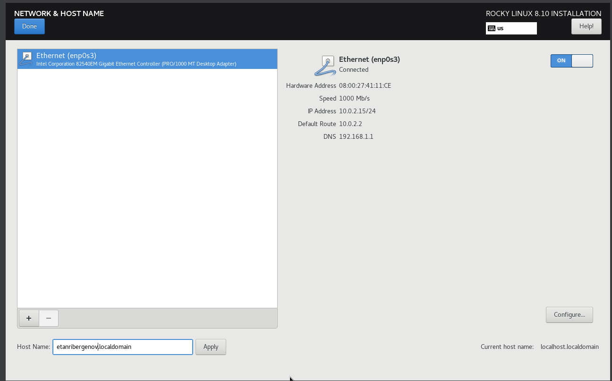{#fig:005 width=70% height=70%}

## Установка ОС на виртуальную машину

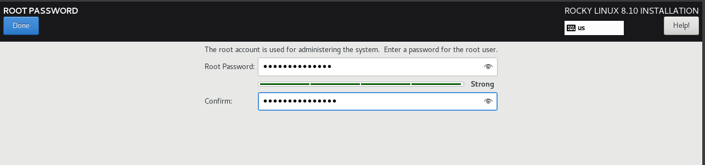{#fig:006}

## Установка ОС на виртуальную машину

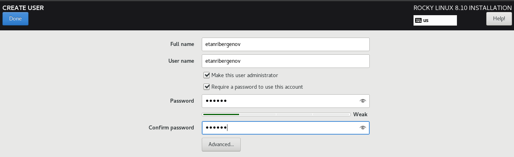{#fig:007}

## Установка ОС на виртуальную машину

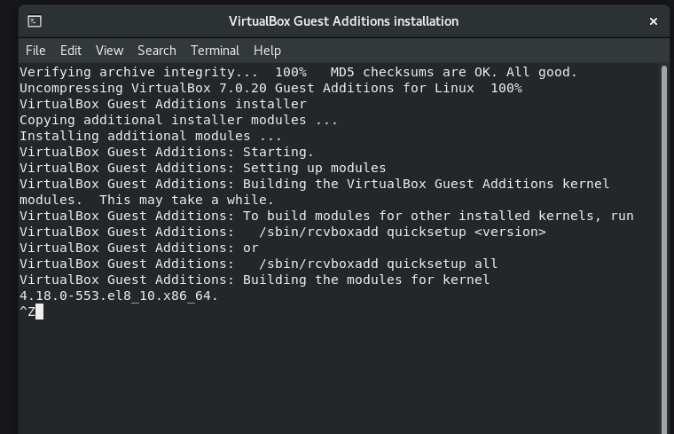{#fig:008 width=70% height=70%}

## Получение информации о системе в терминале

- Использована команда **dmesg | grep -i "то, что ищем"**

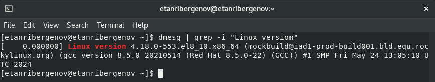{#fig:009 width=70% height=70%}

## Получение информации о системе в терминале

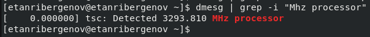{#fig:010}

## Получение информации о системе в терминале

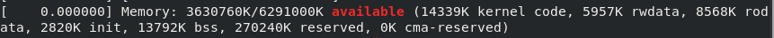{#fig:011}

## Создание репозитория на github

- Использован шаблон репозитория, предложенный курсом на ТУИС
   
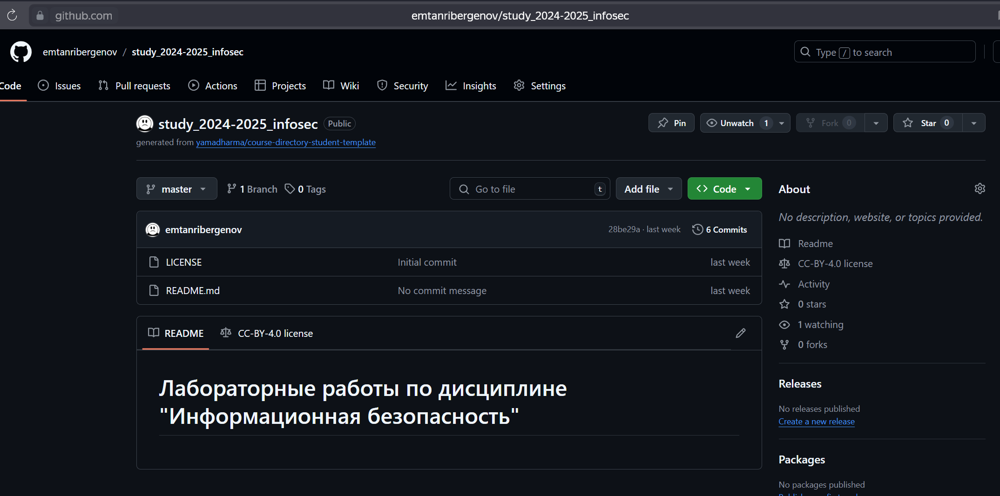{#fig:012 height=70% width=70%}

# Вывод
  
## Вывод

 В результате лабораторной работы я приобрёл практические навыки установки операционной системы на виртуальную машину, настройки минимально необходимых для дальнейшей работы сервисов.
