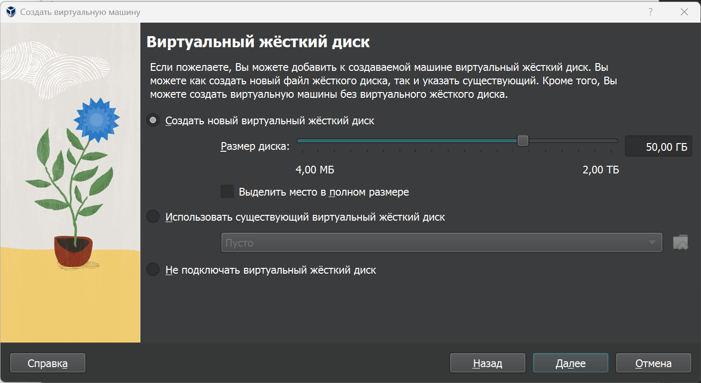
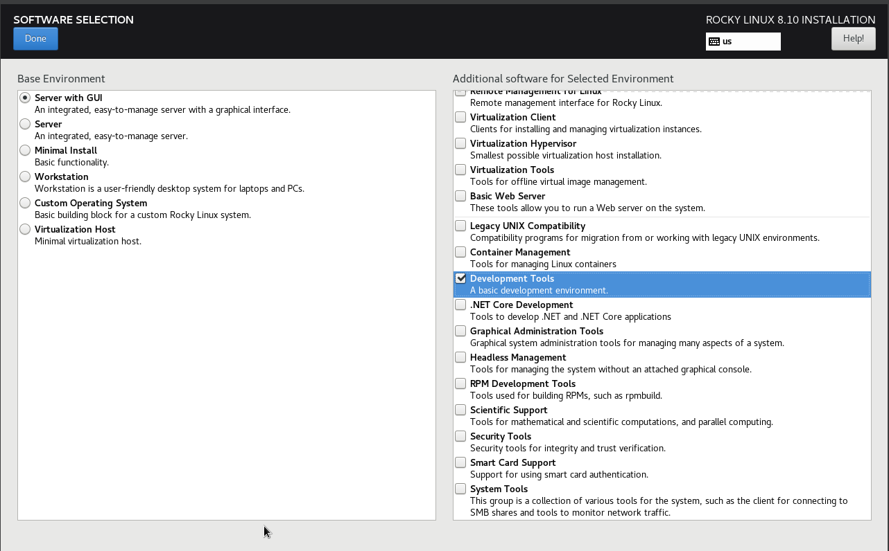
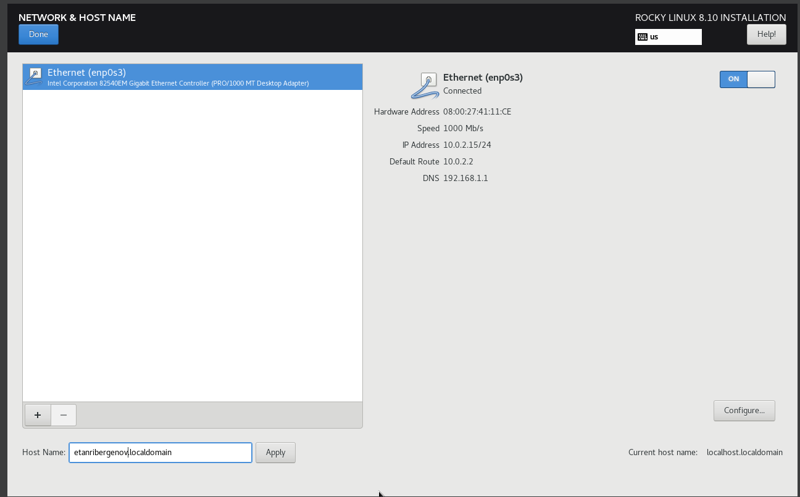
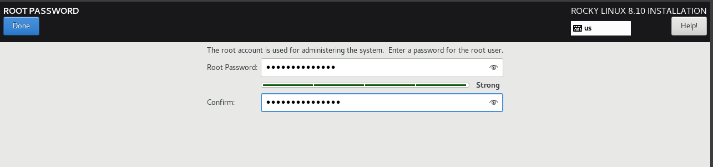
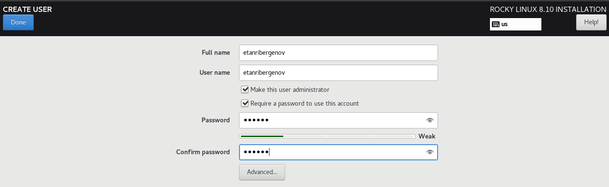
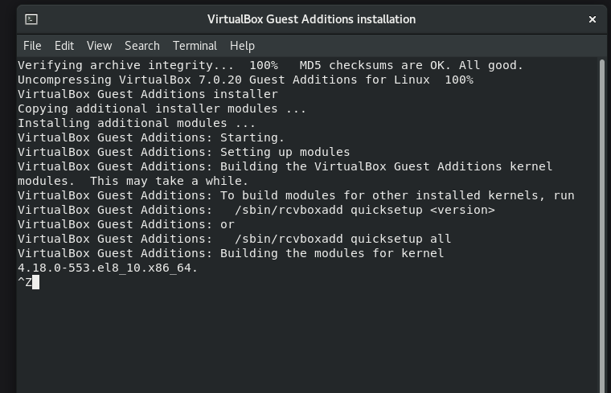

---
## Front matter
title: "Отчёт по лабораторной работе №1"
subtitle: "Дисциплина: Информационная безопасность"
author: "Выполнил: Танрибергенов Эльдар"

## Generic otions
lang: ru-RU
toc-title: "Содержание"

## Bibliography
bibliography: bib/cite.bib
csl: pandoc/csl/gost-r-7-0-5-2008-numeric.csl

## Pdf output format
toc: true # Table of contents
toc-depth: 2
lof: true # List of figures
lot: true # List of tables
fontsize: 12pt
linestretch: 1.5
papersize: a4
documentclass: scrreprt
## I18n polyglossia
polyglossia-lang:
  name: russian
  options:
	- spelling=modern
	- babelshorthands=true
polyglossia-otherlangs:
  name: english
## I18n babel
babel-lang: russian
babel-otherlangs: english
## Fonts
mainfont: IBM Plex Serif
romanfont: IBM Plex Serif
sansfont: IBM Plex Sans
monofont: IBM Plex Mono
mathfont: STIX Two Math
mainfontoptions: Ligatures=Common,Ligatures=TeX,Scale=0.94
romanfontoptions: Ligatures=Common,Ligatures=TeX,Scale=0.94
sansfontoptions: Ligatures=Common,Ligatures=TeX,Scale=MatchLowercase,Scale=0.94
monofontoptions: Scale=MatchLowercase,Scale=0.94,FakeStretch=0.9
mathfontoptions:
## Biblatex
biblatex: true
biblio-style: "gost-numeric"
biblatexoptions:
  - parentracker=true
  - backend=biber
  - hyperref=auto
  - language=auto
  - autolang=other*
  - citestyle=gost-numeric
## Pandoc-crossref LaTeX customization
figureTitle: "Рис."
tableTitle: "Таблица"
listingTitle: "Листинг"
lofTitle: "Список иллюстраций"
lotTitle: "Список таблиц"
lolTitle: "Листинги"
## Misc options
indent: true
header-includes:
  - \usepackage{indentfirst}
  - \usepackage{float} # keep figures where there are in the text
  - \floatplacement{figure}{H} # keep figures where there are in the text
---

# Цель работы

 Целью данной работы является приобретение практических навыков установки операционной системы на виртуальную машину, настройки минимально необходимых для дальнейшей работы сервисов.
 А также создание репозитория на Github для отчётности.

# Задания

 1. Установить ОС на виртуальную машину
 2. Получить информацию о системе в терминале
 3. Создать репозиторий на github
 4. Ответить на контрольные вопросы.

# Теоретическое введение

 Лабораторная работа подразумевает установку на виртуальную машину VirtualBox операционной системы Linux (дистрибутив Rocky).
 При выполнении работы следует придерживаться следующих правил именования: имя виртуальной машины, имя хоста вашей виртуальной машины,
 пользователь внутри виртуальной машины должны совпадать с логином студента, выполняющего лабораторную работу.

# Выполнение лабораторной работы

1. Установка ОС на виртуальную машину
   
1.1. Cоздал новую виртуальную машину. Для этого в VirtualBox выбрал Машина->Создать. Указал имя виртуальной машины - логин в дисплейном классе, тип операционной системы — Linux, RedHat.

{#fig:001}

1.2. Указал размер основной памяти виртуальной машины: память - 6 ГБ, процессоров - 4.

{#fig:002}
 

1.3. Задал конфигурацию жёсткого диска — загрузочный, VDI (BirtualBox Disk Image), динамический виртуальный диск. Задал размер диска — 45 ГБ.

{#fig:003}

1.4. Выберал в VirtualBox для виртуальной машины Настройки->Носители. Добавил новый привод оптических дисков и выберал образ операционной системы.

{#fig:004}

1.5. Запустил виртуальную машину, выбрал English в качестве языка интерфейса и перешёл к настройкам установки операционной системы.

{#fig:005}

{#fig:006}

1.6. Скорректировал часовой пояс, в раскладку клавиатуры добавил русский язык, но в качестве языка по умолчанию указал английский язык.

{#fig:007}

1.7. В разделе выбора программ указал в качестве базового окружения — Server with GUI , а в качестве дополнения — Development Tools.
  
{#fig:008}

1.8. Отключил KDUMP.
  
{#fig:009}

1.9. Включил сетевое соединение и в качестве имени узла указал etanribergenov.localdomain.
  
{#fig:010}

1.10. Установил пароль для root и пользователя с правами администратора.
  
{#fig:011}

{#fig:012}

1.11. После завершения установки операционной системы корректно перезапустил виртуальную машину и принял условия лицензии.

{#fig:013}

{#fig:014}

  
1.12. В VirtualBox оптический диск отключился автоматически.

{#fig:015}

1.13. Вошёл в ОС под заданной при установке учётной записью.
  
{#fig:016}
  
В меню "Устройства виртуальной машины" подключил образ диска дополнений гостевой ОС.

{#fig:017}

{#fig:018}

После этого перезагрузил ВМ.

1.14. Проверил имя хоста (его я задал при настройке установки).

{#fig:019}

  
2. Получение информации о системе в терминале.

2.1. В окне терминала проанализировал последовательность загрузки системы, выполнив команду dmesg. При помощи неё и поиска получил информацию.
Использована команда  **dmesg | grep -i "то, что ищем"**.

2.1.1. Версия ядра Linux.

{#fig:020}

2.1.2. Частота процессора.

{#fig:021}

2.1.3. Модель процессора.

{#fig:022}

2.1.4. Объём доступной оперативной памяти.

{#fig:023}

2.1.5. Тип обнаруженного гипервизора.

{#fig:024}

2.1.6. Тип файловой системы корневого раздела.

{#fig:025}

2.1.7. Последовательность монтирования файловых систем.

{#fig:026}

3. Создание репозитория на Github

3.1. Создал репозиторий git при помощи шаблона.

{#fig:027}

4. Ответы на вопросы

1. Логин и пароль.
2. Команды терминала:
  -? - для получения справки по команде;
  cd – для перемещения по файловой системе;
  ls – для просмотра содержимого каталога;
  du – для определения объёма каталога;
  mkdir(для каталога), touch(для файла) / rm –  для создания / удаления каталогов / файлов;
  chmod – для задания определённых прав на файл / каталог;
  history – для просмотра истории команд.
3. Файловая система — порядок, определяющий способ организации, хранения и именования данных на носителях информации в компьютерах. Основная функция файловой системы — обеспечить удобный доступ к
хранящейся информации пользователю. Благодаря файловой системе пользователи могут легко находить, открывать, редактировать и сохранять файлы на своём устройстве.
4. При помощи команд df/mount.
5. При помощи команды kill. 

# Выводы

 В результате лабораторной работы я приобрёл практические навыки установки операционной системы на виртуальную машину, настройки минимально необходимых для дальнейшей работы сервисов.

# Список литературы{.unnumbered}

::: {#refs}
:::
