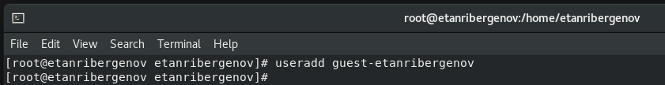
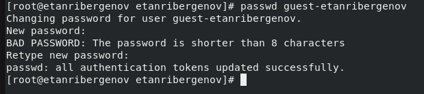
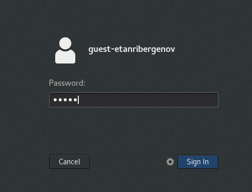
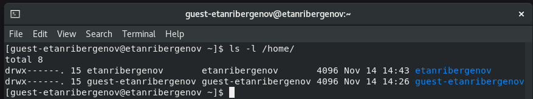
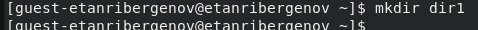
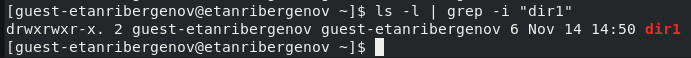
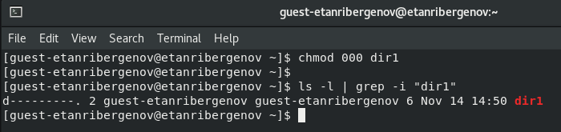
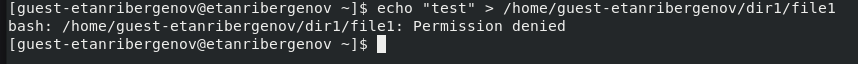
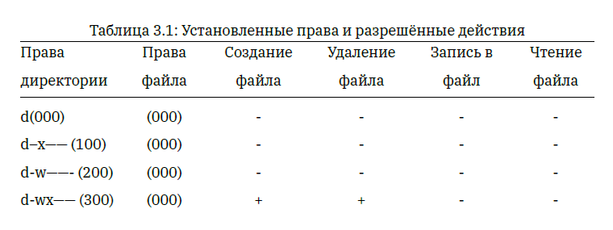
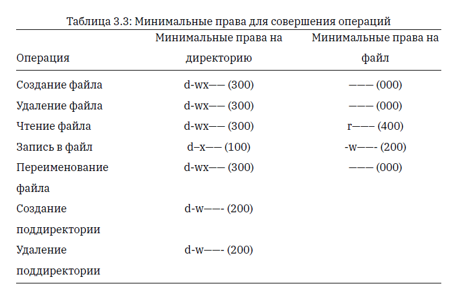

---
## Front matter
lang: ru-RU
title: Презентация по лабораторной работе №2
subtitle: Дискреционное разграничение прав в Linux. Основные атрибуты
author:
  - Танрибергенов Э.
institute:
  - Российский университет дружбы народов, Москва, Россия
date: 2024 г.

## i18n babel
babel-lang: russian
babel-otherlangs: english
## Fonts
mainfont: IBM Plex Serif
romanfont: IBM Plex Serif
sansfont: IBM Plex Sans
monofont: IBM Plex Mono
mathfont: STIX Two Math
mainfontoptions: Ligatures=Common,Ligatures=TeX,Scale=0.94
romanfontoptions: Ligatures=Common,Ligatures=TeX,Scale=0.94
sansfontoptions: Ligatures=Common,Ligatures=TeX,Scale=MatchLowercase,Scale=0.94
monofontoptions: Scale=MatchLowercase,Scale=0.94,FakeStretch=0.9
## Formatting pdf
toc: false
toc-title: Содержание
slide_level: 2
aspectratio: 169
section-titles: true
theme: metropolis
header-includes:
 - \metroset{progressbar=frametitle,sectionpage=progressbar,numbering=fraction}
---

# Информация

## Докладчик

  - Танрибергенов Эльдар
  - студент 4 курса из группы НПИбд-02-21
  - ФМиЕН, кафедра прикладной информатики и теории вероятностей
  - Российский университет дружбы народов

# Цели и задачи

## Цель работы

Получение практических навыков работы в консоли с атрибутами файлов, закрепление теоретических основ дискреционного разграничения доступа в современных системах с открытым кодом на базе ОС Linux.

## Задачи

 1. Создать нового пользователя
 2. Провести работу с правами доступа к директориям и файлам
 3. Заполнить таблицы

# Результаты

## Создание нового пользователя

- Команда ***useradd \<username\>***

{#fig:001}

## Создание нового пользователя

- Команда ***passwd \<user\>***

{#fig:002}

## Создание нового пользователя

{#fig:003}

## Работа с правами доступа к директориям и файлам

- Определение существующих в системе директории командой ***ls -l /home/***.
- *ls \<directory\>* - просмотр содержимого каталога
- параметр -l указывает, что нужно вывести права доступа

{#fig:004}

## Работа с правами доступа к директориям и файлам

- Создание в домашней директории поддиректорию *dir1* командой  ***mkdir dir1***

{#fig:005}

## Работа с правами доступа к директориям и файлам

- Команда  ***ls -l | grep -i "dir1"***
- команда *grep -i "то, что ищем"* осуществляет поиск и выводит строки, где встречается заданное выражение

{#fig:006}

## Работа с правами доступа к директориям и файлам

- Снятие с директории *dir1* всех атрибутов командой ***chmod 000 dir1*** и проверка с помощью команды ***ls -l | grep -i "dir1"*** правильности выполнения команды

{#fig:007}

## Работа с правами доступа к директориям и файлам

- Попытка создания в директории *dir1* файла *file1* 
- команда ***echo "test" > /home/guest-etanribergenov/dir1/file1***.

{#fig:008}

## Создание/заполнение таблицы

- Требовалось опытным путём выяснить доступные операции при разных значениях прав доступа директории и файла и занести данные в таблицу, отмечая знаком "+" доступность операции, и знаком "-" недоступность
- команда ***chmod \<права\> \<файл/директория\>*** - задаёт права доступа
- На основе заполненной таблицы заполнить таблицу с минимальными правами для совершения операции

## Создание/заполнение таблицы

{#fig:009}

## Создание/заполнение таблицы

{#fig:010 width=70% height=70%}

# Вывод
  
## Вывод

 В результате лабораторной работы я приобрёл практические навыки работы в консоли с атрибутами файлов, закрепил теоретические основы дискреционного разграничения доступа в современных системах с открытым кодом на базе ОС Linux.