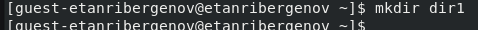
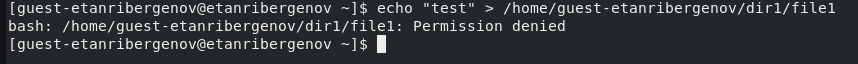

---
## Front matter
title: "Отчёт по лабораторной работе №2"
subtitle: "Дисциплина: Информационная безопасность"
author: "Выполнил: Танрибергенов Эльдар"

## Generic otions
lang: ru-RU
toc-title: "Содержание"

## Bibliography
bibliography: bib/cite.bib
csl: pandoc/csl/gost-r-7-0-5-2008-numeric.csl

## Pdf output format
toc: true # Table of contents
toc-depth: 2
lof: true # List of figures
lot: true # List of tables
fontsize: 12pt
linestretch: 1.5
papersize: a4
documentclass: scrreprt
## I18n polyglossia
polyglossia-lang:
  name: russian
  options:
	- spelling=modern
	- babelshorthands=true
polyglossia-otherlangs:
  name: english
## I18n babel
babel-lang: russian
babel-otherlangs: english
## Fonts
mainfont: IBM Plex Serif
romanfont: IBM Plex Serif
sansfont: IBM Plex Sans
monofont: IBM Plex Mono
mathfont: STIX Two Math
mainfontoptions: Ligatures=Common,Ligatures=TeX,Scale=0.94
romanfontoptions: Ligatures=Common,Ligatures=TeX,Scale=0.94
sansfontoptions: Ligatures=Common,Ligatures=TeX,Scale=MatchLowercase,Scale=0.94
monofontoptions: Scale=MatchLowercase,Scale=0.94,FakeStretch=0.9
mathfontoptions:
## Biblatex
biblatex: true
biblio-style: "gost-numeric"
biblatexoptions:
  - parentracker=true
  - backend=biber
  - hyperref=auto
  - language=auto
  - autolang=other*
  - citestyle=gost-numeric
## Pandoc-crossref LaTeX customization
figureTitle: "Рис."
tableTitle: "Таблица"
listingTitle: "Листинг"
lofTitle: "Список иллюстраций"
lotTitle: "Список таблиц"
lolTitle: "Листинги"
## Misc options
indent: true
header-includes:
  - \usepackage{indentfirst}
  - \usepackage{float} # keep figures where there are in the text
  - \floatplacement{figure}{H} # keep figures where there are in the text
---

# Цель работы

 Получение практических навыков работы в консоли с атрибутами файлов, закрепление теоретических основ дискреционного разграничения доступа в современных системах с открытым кодом на базе ОС Linux.

# Задания

 1. Создать нового пользователя
 2. Провести работу с правами доступа к директориям и файлам
 3. Заполнить таблицы

# Выполнение лабораторной работы

1. Создание нового пользователя

1.1. В установленной при выполнении предыдущей лабораторной работы операционной системе создал учётную запись пользователя guest-etanribergenov

{#fig:001}

1.2. Задал пароль для пользователя guest-etanribergenov:
 команда ***passwd guest-etanribergenov***

{#fig:002}

1.3. Вошёл в систему от имени пользователя guest-etanribergenov.

{#fig:003}

1.4. Определил директорию, в которой я нахожусь, командой ***pwd***.
   Это домашняя директория пользователя guest-etanribergenov

{#fig:004}

Директория совпадает с приглашением командной строки. Она является домашней директорией.

1.5. Уточнил имя своего пользователя командой ***whoami***.

{#fig:005}

1.6. Уточнил имя пользователя, его группу, а также группы, куда входит пользователь, командой ***id***.

{#fig:006}

 Сравнил вывод ***id*** с выводом команды ***groups***. Вторая выводит лишь группы, куда входит текущий пользователь.

{#fig:007}

1.7. Сравнил полученную информацию об имени пользователя с данными, выводимыми в приглашении командной строки - совпадают.

1.8. Просмотрел файл */etc/passwd*, нашёл в нём свою учётную запись командой ***cat /etc/passwd | grep -i "guest"***.
 uid пользователя - 1001, gid пользователя - 1001. Найденные значения совпадают с полученными в предыдущих пунктах.

{#fig:008}

2. Работа с правами доступа к директориям и файлам.

2.1. Определил существующие в системе директории командой ***ls -l /home/***.

{#fig:009}

Удалось получить список поддиректорий директории /home. На директориях установлены права на чтение, запись и открытие только для владельцев.

2.2. Проверил, какие расширенные атрибуты установлены на поддиректориях, находящихся в директории /home, командой: ***lsattr /home***.

{#fig:010}

Расширенные атрибуты директории текущего пользователя увидеть удалось, а других пользователей - нет: отказано в доступе.

2.3. Создал в домашней директории поддиректорию *dir1* 

командой  ***mkdir dir1***.

{#fig:011}

Командой  ***ls -l | grep -i "dir1"***  определил, что владельцу и группе доступно всё, а остальным пользователям - только чтение и выполнение.

{#fig:012}

Командой ***lsattr | grep -i "dir1"***  определил выставленные на директорию *dir1* расширенные атрибуты.

{#fig:013}

2.4. Снял с директории dir1 все атрибуты командой ***chmod 000 dir1*** и проверил с помощью 

команды ***ls -l | grep -i "dir1"*** правильность выполнения команды.

{#fig:014}

2.5. Попытался создать в директории *dir1* файл *file1* 

командой ***echo "test" > /home/guest-etanribergenov/dir1/file1***.

{#fig:015}

Файл создать не удалось, т.к. право на это было изъято в предыдущем пункте.

Неясно как сообщение об ошибке отразилось на создании файла. 

Проверка командой ***ls -l /home/guest-etanribergenov/dir1*** не дала точного ответа, создан ли был файл или нет, т.к. доступ на чтение не разрешён.

{#fig:016}

3. Заполнение таблиц.

: Установленные права и разрешённые действия {#tbl:001}

|Права директории |Права файла |Создание файла |Удаление файла |Запись в файл |Чтение файла | 
|---------------- |:----------:|:-------------:|:-------------:|:------------:|:-----------:|
| d(000)          | (000)      | -             | -             | -            | -           |
| d--x------ (100)| (000)      | -             | -             | -            | -           |
| d-w------- (200)| (000)      | -             | -             | -            | -           |
| d-wx------ (300)| (000)      | +             | +             | -            | -           |
| dr-------- (400)| (000)      | -             | -             | -            | -           |
| dr-x------ (500)| (000)      | -             | -             | -            | -           |
| drw------- (600)| (000)      | -             | -             | -            | -           |
| drwx------ (700)| (000)      | +             | +             | -            | -           |
| d(000)          | (100)      | -             | -             | -            | -           |
| d--x------ (100)| (100)      | -             | -             | -            | -           |
| d-w------- (200)| (100)      | -             | -             | -            | -           |
| d-wx------ (300)| (100)      | +             | +             | -            | -           |
| dr-------- (400)| (100)      | -             | -             | -            | -           |
| dr-x------ (500)| (100)      | -             | -             | -            | -           |
| drw------- (600)| (100)      | -             | -             | -            | -           |
| drwx------ (700)| (100)      | +             | +             | -            | -           |
| d(000)          | (200)      | -             | -             | -            | -           |
| d--x------ (100)| (200)      | -             | -             | +            | -           |
| d-w------- (200)| (200)      | -             | -             | -            | -           |
| d-wx------ (300)| (200)      | +             | +             | +            | -           |
| dr-------- (400)| (200)      | -             | -             | -            | -           |
| dr-x------ (500)| (200)      | -             | -             | +            | -           | 
| drw------- (600)| (200)      | -             | -             | -            | -           |
| drwx------ (700)| (200)      | +             | +             | +            | -           |
| d(000)          | (300)      | -             | -             | -            | -           |
| d--x------ (100)| (300)      | -             | -             | +            | -           |
| d-w------- (200)| (300)      | -             | -             | -            | -           | 
| d-wx------ (300)| (300)      | +             | +             | +            | -           | 
| dr-------- (400)| (300)      | -             | -             | -            | -           |
| dr-x------ (500)| (300)      | -             | -             | +            | -           | 
| drw------- (600)| (300)      | -             | -             | -            | -           | 
| drwx------ (700)| (300)      | +             | +             | +            | -           | 
| d(000)          | (400)      | -             | -             | -            | -           | 
| d--x------ (100)| (400)      | -             | -             | -            | -           | 
| d-w------- (200)| (400)      | -             | -             | -            | -           | 
| d-wx------ (300)| (400)      | +             | +             | -            | +           |
| dr-------- (400)| (400)      | -             | -             | -            | -           |
| dr-x------ (500)| (400)      | -             | -             | -            | +           |
| drw------- (600)| (400)      | -             | -             | -            | -           |
| drwx------ (700)| (400)      | +             | +             | -            | +           |
| d(000)          | (500)      | -             | -             | -            | -           |
| d--x------ (100)| (500)      | -             | -             | -            | +           |
| d-w------- (200)| (500)      | -             | -             | -            | -           |
| d-wx------ (300)| (500)      | +             | +             | -            | +           |
| dr-------- (400)| (500)      | -             | -             | -            | -           |
| dr-x------ (500)| (500)      | -             | -             | -            | +           |
| drw------- (600)| (500)      | -             | -             | -            | -           |
| drwx------ (700)| (500)      | +             | +             | -            | +           |
| d(000)          | (600)      | -             | -             | -            | -           |
| d--x------ (100)| (600)      | -             | -             | +            | +           |
| d-w------- (200)| (600)      | -             | -             | -            | -           |
| d-wx------ (300)| (600)      | +             | +             | +            | +           |
| dr-------- (400)| (600)      | -             | -             | -            | -           |
| dr-x------ (500)| (600)      | -             | -             | +            | +           |
| drw------- (600)| (600)      | -             | -             | -            | -           |
| drwx------ (700)| (600)      | +             | +             | +            | +           |
| d(000)          | (700)      | -             | -             | -            | -           |
| d--x------ (100)| (700)      | -             | -             | +            | +           |
| d-w------- (200)| (700)      | -             | -             | -            | -           |
| d-wx------ (300)| (700)      | +             | +             | +            | +           |
| dr-------- (400)| (700)      | -             | -             | -            | -           |
| dr-x------ (500)| (700)      | -             | -             | +            | +           |
| drw------- (600)| (700)      | -             | -             | -            | -           |
| drwx------ (700)| (700)      | +             | +             | +            | +           |

: Установленные права и разрешённые действия {#tbl:002}

|Права директории |Права файла |Смена директории | Просмотр файлов в директории |Переименование файла |Смена атрибутов файла |
|---------------- |:----------:|:---------------:|:----------------------------:|:-------------------:|:--------------------:|
| d(000)          | (000)      | -               | -                            | -                   | -                    |
| d--x------ (100)| (000)      | +               | -                            | -                   | +                    |
| d-w------- (200)| (000)      | -               | -                            | -                   | -                    |
| d-wx------ (300)| (000)      | +               | -                            | +                   | +                    |
| dr-------- (400)| (000)      | -               | +                            | -                   | -                    |
| dr-x------ (500)| (000)      | +               | +                            | -                   | +                    |
| drw------- (600)| (000)      | -               | +                            | -                   | -                    |
| drwx------ (700)| (000)      | +               | +                            | +                   | +                    |
| d(000)          | (100)      | -               | -                            | -                   | -                    |
| d--x------ (100)| (100)      | +               | -                            | -                   | +                    |
| d-w------- (200)| (100)      | -               | -                            | -                   | -                    |
| d-wx------ (300)| (100)      | +               | -                            | +                   | +                    |
| dr-------- (400)| (100)      | -               | +                            | -                   | -                    |
| dr-x------ (500)| (100)      | +               | +                            | -                   | +                    |
| drw------- (600)| (100)      | -               | +                            | -                   | -                    |
| drwx------ (700)| (100)      | +               | +                            | +                   | +                    |
| d(000)          | (200)      | -               | -                            | -                   | -                    |
| d--x------ (100)| (200)      | +               | -                            | -                   | +                    |
| d-w------- (200)| (200)      | -               | -                            | -                   | -                    |
| d-wx------ (300)| (200)      | +               | -                            | +                   | +                    |
| dr-------- (400)| (200)      | -               | +                            | -                   | -                    |
| dr-x------ (500)| (200)      | +               | +                            | -                   | +                    |
| drw------- (600)| (200)      | -               | +                            | -                   | -                    |
| drwx------ (700)| (200)      | +               | +                            | +                   | +                    |
| d(000)          | (300)      | -               | -                            | -                   | -                    |
| d--x------ (100)| (300)      | +               | -                            | -                   | +                    |
| d-w------- (200)| (300)      | -               | -                            | -                   | -                    |
| d-wx------ (300)| (300)      | +               | -                            | +                   | +                    |
| dr-------- (400)| (300)      | -               | +                            | -                   | -                    |
| dr-x------ (500)| (300)      | +               | +                            | -                   | +                    |
| drw------- (600)| (300)      | -               | +                            | -                   | -                    |
| drwx------ (700)| (300)      | +               | +                            | +                   | +                    |
| d(000)          | (400)      | -               | -                            | -                   | -                    |
| d--x------ (100)| (400)      | +               | -                            | -                   | +                    |
| d-w------- (200)| (400)      | -               | -                            | -                   | -                    |
| d-wx------ (300)| (400)      | +               | -                            | +                   | +                    |
| dr-------- (400)| (400)      | -               | +                            | -                   | -                    |
| dr-x------ (500)| (400)      | +               | +                            | -                   | +                    |
| drw------- (600)| (400)      | -               | +                            | -                   | -                    |
| drwx------ (700)| (400)      | +               | +                            | +                   | +                    |
| d(000)          | (500)      | -               | -                            | -                   | -                    |
| d--x------ (100)| (500)      | +               | -                            | -                   | +                    |
| d-w------- (200)| (500)      | -               | -                            | -                   | -                    |
| d-wx------ (300)| (500)      | +               | -                            | +                   | +                    |
| dr-------- (400)| (500)      | -               | +                            | -                   | -                    |
| dr-x------ (500)| (500)      | +               | +                            | -                   | +                    |
| drw------- (600)| (500)      | -               | +                            | -                   | -                    |
| drwx------ (700)| (500)      | +               | +                            | +                   | +                    |
| d(000)          | (600)      | -               | -                            | -                   | -                    |
| d--x------ (100)| (600)      | +               | -                            | -                   | +                    |
| d-w------- (200)| (600)      | -               | -                            | -                   | -                    |
| d-wx------ (300)| (600)      | +               | -                            | +                   | +                    |
| dr-------- (400)| (600)      | -               | +                            | -                   | -                    |
| dr-x------ (500)| (600)      | +               | +                            | -                   | +                    |
| drw------- (600)| (600)      | -               | +                            | -                   | -                    |
| drwx------ (700)| (600)      | +               | +                            | +                   | +                    |
| d(000)          | (700)      | -               | -                            | -                   | -                    |
| d--x------ (100)| (700)      | +               | -                            | -                   | +                    |
| d-w------- (200)| (700)      | -               | -                            | -                   | -                    |
| d-wx------ (300)| (700)      | +               | -                            | +                   | +                    |
| dr-------- (400)| (700)      | -               | +                            | -                   | -                    |
| dr-x------ (500)| (700)      | +               | +                            | -                   | +                    |
| drw------- (600)| (700)      | -               | +                            | -                   | -                    |
| drwx------ (700)| (700)      | +               | +                            | +                   | +                    |

: Минимальные права для совершения операций {#tbl:003}

| Операция              | Минимальные права на директорию | Минимальные права на файл |
|-----------------------|:-------------------------------:|:-------------------------:|
|Создание файла         |  d-wx------ (300)               |  --------- (000)          |
|Удаление файла         |  d-wx------ (300)               |  --------- (000)          |
|Чтение файла           |  d-wx------ (300)               |  r-------- (400)          |
|Запись в файл          |  d--x------ (100)               |  -w------- (200)          |
|Переименование файла   |  d-wx------ (300)               |  --------- (000)          |
|Создание поддиректории |  d-w------- (200)               |                           |
|Удаление поддиректории |  d-w------- (200)               |                           |

# Выводы

 В результате лабораторной работы я приобрёл практические навыки работы в консоли с атрибутами файлов, закрепил теоретические основы дискреционного разграничения доступа в современных системах с открытым кодом на базе ОС Linux.

