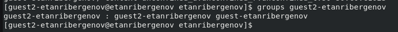
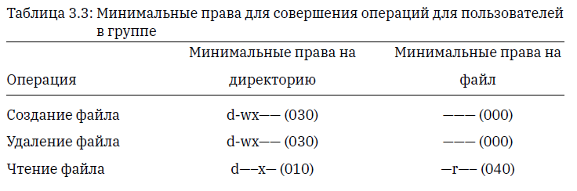

---
## Front matter
lang: ru-RU
title: Презентация по лабораторной работе №3
subtitle: Дискреционное разграничение прав в Linux. Два пользователя
author:
  - Танрибергенов Э.
institute:
  - Российский университет дружбы народов, Москва, Россия
date: 2024 г.

## i18n babel
babel-lang: russian
babel-otherlangs: english
## Fonts
mainfont: IBM Plex Serif
romanfont: IBM Plex Serif
sansfont: IBM Plex Sans
monofont: IBM Plex Mono
mathfont: STIX Two Math
mainfontoptions: Ligatures=Common,Ligatures=TeX,Scale=0.94
romanfontoptions: Ligatures=Common,Ligatures=TeX,Scale=0.94
sansfontoptions: Ligatures=Common,Ligatures=TeX,Scale=MatchLowercase,Scale=0.94
monofontoptions: Scale=MatchLowercase,Scale=0.94,FakeStretch=0.9
## Formatting pdf
toc: false
toc-title: Содержание
slide_level: 2
aspectratio: 169
section-titles: true
theme: metropolis
header-includes:
 - \metroset{progressbar=frametitle,sectionpage=progressbar,numbering=fraction}
---

# Информация

## Докладчик

  - Танрибергенов Эльдар
  - студент 4 курса из группы НПИбд-02-21
  - ФМиЕН, кафедра прикладной информатики и теории вероятностей
  - Российский университет дружбы народов

# Цели и задачи

## Цель работы

 Получение практических навыков работы в консоли с атрибутами файлов для групп пользователей.

## Задачи

 1. Создать нового пользователя и добавить его в группу другого пользователя.
 2. Заполнить таблицы, опытным путём выявляя разрешённые операции при разных значениях прав для группы.

# Результаты

## Создание нового пользователя и добавление его в группу

- Команда ***useradd \<username\>*** - создаёт пользователя
- Команда ***passwd \<user\>*** - устанавливает пароль

{#fig:001}

## Создание нового пользователя и добавление его в группу

- Команда ***gpasswd -a \<user\> \<groupname\>***
- Пользователь *guest2-etanribergenov* добавлен в группу *guest-etanribergenov*

{#fig:002}

## Создание нового пользователя и добавление его в группу

- Проверка добавления пользователя в группу

{#fig:003}

## Создание нового пользователя и добавление его в группу

- Регистрация пользователя *guest2-etanribergenov* в группе *guest-etanribergenov* от имени пользователя *guest2-etanribergenov*
- команда:  ***newgrp guest-etanribergenov***

{#fig:004}

## Заполнение таблиц

- Открыто две консоли: в 1-й вход в систему осуществлён от имени пользователя *guest-etanribergenov*, во 2-й  -  от имени *guest2-etanribergenov*, который входит в группу первого пользователя.
- От имени пользователя *guest-etanribergenov* изменены права директории */home/guest-etanribergenov*, разрешив все действия для пользователей группы
- Последовательная смена прав на директорию и файла для группы в консоли 1.
- Проверка разрешённых действий с директорией и файлом из консоли 2.
- Полученные данные занесены в таблицу, отмечая знаком "+", если действие разрешено, и знаком "-", если запрещено.
- Команда установки прав доступа: ***chmod \<права\> \<файл/директория\>***

## Заполнение таблиц

- В одной консоли вход от имени *guest-etanribergenov*
- команда ***su \<пользователь\>***

{#fig:005}

## Заполнение таблиц

- Во второй консоли вход от имени *guest2-etanribergenov*
- команда ***su \<пользователь\>***

{#fig:006}

## Заполнение таблиц

- Изменение прав директории */home/guest-etanribergenov* от имени пользователя *guest-etanribergenov*, разрешив все действия для пользователей группы

{#fig:007}

## Заполнение таблиц

{#fig:008 width=70% height=70%}

## Заполнение таблиц

{#fig:009 width=70% height=70%}

## Заполнение таблиц

{#fig:010 width=70% height=70%}

## Заполнение таблиц

{#fig:011 width=70% height=70%}

# Вывод
  
## Вывод

 В результате лабораторной работы я приобрёл практические навыки работы в консоли с атрибутами файлов для групп пользователей.