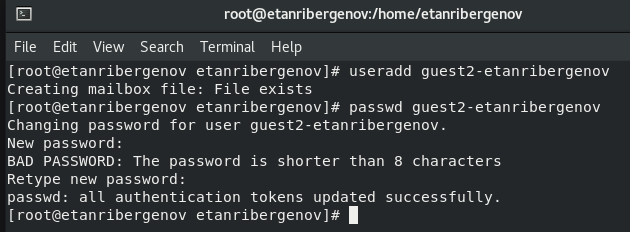
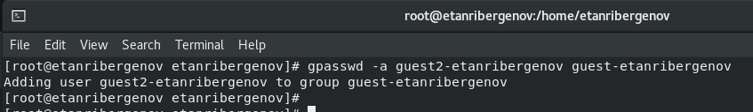
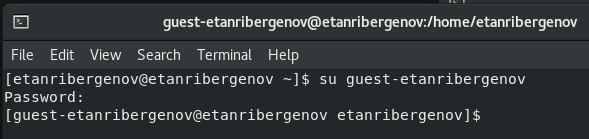

---
## Front matter
title: "Отчёт по лабораторной работе №3"
subtitle: "Дисциплина: Информационная безопасность"
author: "Выполнил: Танрибергенов Эльдар"

## Generic otions
lang: ru-RU
toc-title: "Содержание"

## Bibliography
bibliography: bib/cite.bib
csl: pandoc/csl/gost-r-7-0-5-2008-numeric.csl

## Pdf output format
toc: true # Table of contents
toc-depth: 2
lof: true # List of figures
lot: true # List of tables
fontsize: 12pt
linestretch: 1.5
papersize: a4
documentclass: scrreprt
## I18n polyglossia
polyglossia-lang:
  name: russian
  options:
	- spelling=modern
	- babelshorthands=true
polyglossia-otherlangs:
  name: english
## I18n babel
babel-lang: russian
babel-otherlangs: english
## Fonts
mainfont: IBM Plex Serif
romanfont: IBM Plex Serif
sansfont: IBM Plex Sans
monofont: IBM Plex Mono
mathfont: STIX Two Math
mainfontoptions: Ligatures=Common,Ligatures=TeX,Scale=0.94
romanfontoptions: Ligatures=Common,Ligatures=TeX,Scale=0.94
sansfontoptions: Ligatures=Common,Ligatures=TeX,Scale=MatchLowercase,Scale=0.94
monofontoptions: Scale=MatchLowercase,Scale=0.94,FakeStretch=0.9
mathfontoptions:
## Biblatex
biblatex: true
biblio-style: "gost-numeric"
biblatexoptions:
  - parentracker=true
  - backend=biber
  - hyperref=auto
  - language=auto
  - autolang=other*
  - citestyle=gost-numeric
## Pandoc-crossref LaTeX customization
figureTitle: "Рис."
tableTitle: "Таблица"
listingTitle: "Листинг"
lofTitle: "Список иллюстраций"
lotTitle: "Список таблиц"
lolTitle: "Листинги"
## Misc options
indent: true
header-includes:
  - \usepackage{indentfirst}
  - \usepackage{float} # keep figures where there are in the text
  - \floatplacement{figure}{H} # keep figures where there are in the text
---

# Цель работы

 Получение практических навыков работы в консоли с атрибутами файлов для групп пользователей.

# Задания

 1. Создать нового пользователя и добавить его в группу другого пользователя.
 2. Заполнить таблицы, опытным путём выявляя разрешённые операции при разных значениях прав для группы.

# Выполнение лабораторной работы

1. Создание нового пользователя

1.1. Пользователь guest-etanribergenov уже был создан в лабораторной работе №2.
1.2. Создал учётную запись пользователя guest2-etanribergenov и задал пароль.

{#fig:001}

1.3. Добавил пользователя guest2-etanribergenov в группу guest-etanribergenov:

`gpasswd -a guest2-etanribergenov guest-etanribergenov`

{#fig:002}

1.4. Осуществил вход в систему от двух пользователей на двух разных консолях: guest-etanribergenov на первой консоли и guest2-etanribergenov на второй консоли.

{#fig:003}

{#fig:004}

1.5. Для обоих пользователей командой *pwd* определил директорию, в которой нахожусь. Отличаются от приглашений командной строки, т.к. сеанс запущен другим пользователем.

{#fig:005}

{#fig:006}

1.6. Уточнил имена пользователей, их группы, кто входит в них и к каким группам принадлежат они сами. 

{#fig:007}

{#fig:008}

Командами ***groups guest-etanribergenov*** и ***groups guest2-etanribergenov*** определил, что *guest-etanribergenov* входит лишь в свою группу, а *guest2-etanribergenov* входит как в свою, так и в группу *guest-etanribergenov*.

{#fig:009}

{#fig:010}

Команда ***id -Gn***, как и команда ***groups***, вывела названия групп, в которые входит пользователь, а команда ***id -G*** вывела id этих групп.

{#fig:011}

{#fig:012}

1.7. Сравнил полученную информацию с содержимым файла */etc/group*: в файле */etc/group* просто чуть иначе записано и нет разницы в содержимом от того, каким пользователем этот файл был просмотрен.

{#fig:013}

1.8. От имени пользователя *guest2-etanribergenov* выполнил регистрацию пользователя *guest2-etanribergenov* в группе *guest-etanribergenov* командой

`newgrp guest-etanribergenov`

{#fig:014}

1.9. От имени пользователя *guest-etanribergenov* изменил права директории */home/guest-etanribergenov*, разрешив все действия для пользователей группы:

`chmod g+rwx /home/guest-etanribergenov`

{#fig:015}

1.10. От имени пользователя *guest-etanribergenov* снял с директории */home/guest/dir1* все атрибуты

{#fig:016}

2. Заполнил таблицы, опытным путём выявляя разрешённые операции при разных значениях прав для группы.

: Установленные права и разрешённые действия для групп {#tbl:001}

|Права директории |Права файла |Создание файла |Удаление файла |Запись в файл |Чтение файла | 
|---------------- |:----------:|:-------------:|:-------------:|:------------:|:-----------:|
| d(000)          | (000)      | -             | -             | -            | -           |
| d-----x--- (010)| (000)      | -             | -             | -            | -           |
| d----w---- (020)| (000)      | -             | -             | -            | -           |
| d----wx--- (030)| (000)      | +             | +             | -            | -           |
| d---r----- (040)| (000)      | -             | -             | -            | -           |
| d---r-x--- (050)| (000)      | -             | -             | -            | -           |
| d---rw---- (060)| (000)      | -             | -             | -            | -           |
| d---rwx--- (070)| (000)      | +             | +             | -            | -           |
| d(000)          | (010)      | -             | -             | -            | -           |
| d-----x--- (010)| (010)      | -             | -             | -            | -           |
| d----w---- (020)| (010)      | -             | -             | -            | -           |
| d----wx--- (030)| (010)      | +             | +             | -            | -           |
| d---r----- (040)| (010)      | -             | -             | -            | -           |
| d---r-x--- (050)| (010)      | -             | -             | -            | -           |
| d---rw---- (060)| (010)      | -             | -             | -            | -           |
| d---rwx--- (070)| (010)      | +             | +             | -            | -           |
| d(000)          | (020)      | -             | -             | -            | -           |
| d-----x--- (010)| (020)      | -             | -             | +            | -           |
| d----w---- (020)| (020)      | -             | -             | -            | -           |
| d----wx--- (030)| (020)      | +             | +             | +            | -           |
| d---r----- (040)| (020)      | -             | -             | -            | -           |
| d---r-x--- (050)| (020)      | -             | -             | +            | -           | 
| d---rw---- (060)| (020)      | -             | -             | -            | -           |
| d---rwx--- (070)| (020)      | +             | +             | +            | -           |
| d(000)          | (030)      | -             | -             | -            | -           |
| d-----x--- (010)| (030)      | -             | -             | +            | -           |
| d----w---- (020)| (030)      | -             | -             | -            | -           | 
| d----wx--- (030)| (030)      | +             | +             | +            | -           | 
| d---r----- (040)| (030)      | -             | -             | -            | -           |
| d---r-x--- (050)| (030)      | -             | -             | +            | -           | 
| d---rw---- (060)| (030)      | -             | -             | -            | -           | 
| d---rwx--- (070)| (030)      | +             | +             | +            | -           | 
| d(000)          | (040)      | -             | -             | -            | -           | 
| d-----x--- (010)| (040)      | -             | -             | -            | +           | 
| d----w---- (020)| (040)      | -             | -             | -            | -           | 
| d----wx--- (030)| (040)      | +             | +             | -            | +           |
| d---r----- (040)| (040)      | -             | -             | -            | -           |
| d---r-x--- (050)| (040)      | -             | -             | -            | +           |
| d---rw---- (060)| (040)      | -             | -             | -            | -           |
| d---rwx--- (070)| (040)      | +             | +             | -            | +           |
| d(000)          | (050)      | -             | -             | -            | -           |
| d-----x--- (010)| (050)      | -             | -             | -            | +           |
| d----w---- (020)| (050)      | -             | -             | -            | -           |
| d----wx--- (030)| (050)      | +             | +             | -            | +           |
| d---r----- (040)| (050)      | -             | -             | -            | -           |
| d---r-x--- (050)| (050)      | -             | -             | -            | +           |
| d---rw---- (060)| (050)      | -             | -             | -            | -           |
| d---rwx--- (070)| (050)      | +             | +             | -            | +           |
| d(000)          | (060)      | -             | -             | -            | -           |
| d-----x--- (010)| (060)      | -             | -             | +            | +           |
| d----w---- (020)| (060)      | -             | -             | -            | -           |
| d----wx--- (030)| (060)      | +             | +             | +            | +           |
| d---r----- (040)| (060)      | -             | -             | -            | -           |
| d---r-x--- (050)| (060)      | -             | -             | +            | +           |
| d---rw---- (060)| (060)      | -             | -             | -            | -           |
| d---rwx--- (070)| (060)      | +             | +             | +            | +           |
| d(000)          | (070)      | -             | -             | -            | -           |
| d-----x--- (010)| (070)      | -             | -             | +            | +           |
| d----w---- (020)| (070)      | -             | -             | -            | -           |
| d----wx--- (030)| (070)      | +             | +             | +            | +           |
| d---r----- (040)| (070)      | -             | -             | -            | -           |
| d---r-x--- (050)| (070)      | -             | -             | +            | +           |
| d---rw---- (060)| (070)      | -             | -             | -            | -           |
| d---rwx--- (070)| (070)      | +             | +             | +            | +           |

: Установленные права и разрешённые действия для групп {#tbl:002}

|Права директории |Права файла |Смена директории |Просмотр файлов в директории |Переименование файла |Смена атрибутов файла | 
|---------------- |:----------:|:---------------:|:---------------------------:|:-------------------:|:--------------------:|
| d(000)          | (000)      | -               | -                           | -                   | -                    |
| d-----x--- (010)| (000)      | +               | -                           | -                   | +                    |
| d----w---- (020)| (000)      | -               | -                           | -                   | -                    |
| d----wx--- (030)| (000)      | +               | -                           | +                   | +                    |
| d---r----- (040)| (000)      | -               | +                           | -                   | -                    |
| d---r-x--- (050)| (000)      | +               | +                           | -                   | +                    |
| d---rw---- (060)| (000)      | -               | +                           | -                   | -                    |
| d---rwx--- (070)| (000)      | +               | +                           | +                   | +                    |
| d(000)          | (010)      | -               | -                           | -                   | -                    |
| d-----x--- (010)| (010)      | +               | -                           | -                   | +                    |
| d----w---- (020)| (010)      | -               | -                           | -                   | -                    |
| d----wx--- (030)| (010)      | +               | -                           | +                   | +                    |
| d---r----- (040)| (010)      | -               | +                           | -                   | -                    |
| d---r-x--- (050)| (010)      | +               | +                           | -                   | +                    |
| d---rw---- (060)| (010)      | -               | +                           | -                   | -                    |
| d---rwx--- (070)| (010)      | +               | +                           | +                   | +                    |
| d(000)          | (020)      | -               | -                           | -                   | -                    |
| d-----x--- (010)| (020)      | +               | -                           | -                   | +                    |
| d----w---- (020)| (020)      | -               | -                           | -                   | -                    |
| d----wx--- (030)| (020)      | +               | -                           | +                   | +                    |
| d---r----- (040)| (020)      | -               | +                           | -                   | -                    |
| d---r-x--- (050)| (020)      | +               | +                           | -                   | +                    | 
| d---rw---- (060)| (020)      | -               | +                           | -                   | -                    |
| d---rwx--- (070)| (020)      | +               | +                           | +                   | +                    |
| d(000)          | (030)      | -               | -                           | -                   | -                    |
| d-----x--- (010)| (030)      | +               | -                           | -                   | +                    |
| d----w---- (020)| (030)      | -               | -                           | -                   | -                    | 
| d----wx--- (030)| (030)      | +               | -                           | +                   | +                    | 
| d---r----- (040)| (030)      | -               | +                           | -                   | -                    |
| d---r-x--- (050)| (030)      | +               | +                           | -                   | +                    | 
| d---rw---- (060)| (030)      | -               | +                           | -                   | -                    | 
| d---rwx--- (070)| (030)      | +               | +                           | +                   | +                    |
| d(000)          | (040)      | -               | -                           | -                   | -                    | 
| d-----x--- (010)| (040)      | +               | -                           | -                   | +                    | 
| d----w---- (020)| (040)      | -               | -                           | -                   | -                    | 
| d----wx--- (030)| (040)      | +               | -                           | +                   | +                    |
| d---r----- (040)| (040)      | -               | +                           | -                   | -                    |
| d---r-x--- (050)| (040)      | +               | +                           | -                   | +                    |
| d---rw---- (060)| (040)      | -               | +                           | -                   | -                    |
| d---rwx--- (070)| (040)      | +               | +                           | +                   | +                    |
| d(000)          | (050)      | -               | -                           | -                   | -                    |
| d-----x--- (010)| (050)      | +               | -                           | -                   | +                    |
| d----w---- (020)| (050)      | -               | -                           | -                   | -                    |
| d----wx--- (030)| (050)      | +               | -                           | +                   | +                    |
| d---r----- (040)| (050)      | -               | +                           | -                   | -                    |
| d---r-x--- (050)| (050)      | +               | +                           | -                   | +                    |
| d---rw---- (060)| (050)      | -               | +                           | -                   | -                    |
| d---rwx--- (070)| (050)      | +               | +                           | +                   | +                    |
| d(000)          | (060)      | -               | -                           | -                   | -                    |
| d-----x--- (010)| (060)      | +               | -                           | -                   | +                    |
| d----w---- (020)| (060)      | -               | -                           | -                   | -                    |
| d----wx--- (030)| (060)      | +               | -                           | +                   | +                    |
| d---r----- (040)| (060)      | -               | +                           | -                   | -                    |
| d---r-x--- (050)| (060)      | +               | +                           | -                   | +                    |
| d---rw---- (060)| (060)      | -               | +                           | -                   | -                    |
| d---rwx--- (070)| (060)      | +               | +                           | +                   | +                    |
| d(000)          | (070)      | -               | -                           | -                   | -                    |
| d-----x--- (010)| (070)      | +               | -                           | -                   | +                    |
| d----w---- (020)| (070)      | -               | -                           | -                   | -                    |
| d----wx--- (030)| (070)      | +               | -                           | +                   | +                    |
| d---r----- (040)| (070)      | -               | +                           | -                   | -                    |
| d---r-x--- (050)| (070)      | +               | +                           | -                   | +                    |
| d---rw---- (060)| (070)      | -               | +                           | -                   | -                    |
| d---rwx--- (070)| (070)      | +               | +                           | +                   | +                    |

: Минимальные права для совершения операций для пользователей в группе {#tbl:003}

| Операция              | Минимальные права на директорию | Минимальные права на файл |
|-----------------------|:-------------------------------:|:-------------------------:|
|Создание файла         |  d-wx------ (030)               |  --------- (000)          |
|Удаление файла         |  d-wx------ (030)               |  --------- (000)          |
|Чтение файла           |  d-----x--- (010)               |  ---r----- (040)          |
|Запись в файл          |  d-----x--- (010)               |  ----w---- (020)          |
|Переименование файла   |  d-wx------ (030)               |  --------- (000)          |
|Создание поддиректории |  d-w------- (020)               |                           |
|Удаление поддиректории |  d-w------- (020)               |                           |

В итоге, разницы между этой таблицей и из предыдущей ЛР нет.

# Выводы

 В результате лабораторной работы я приобрёл практические навыки работы в консоли с атрибутами файлов для групп пользователей.

