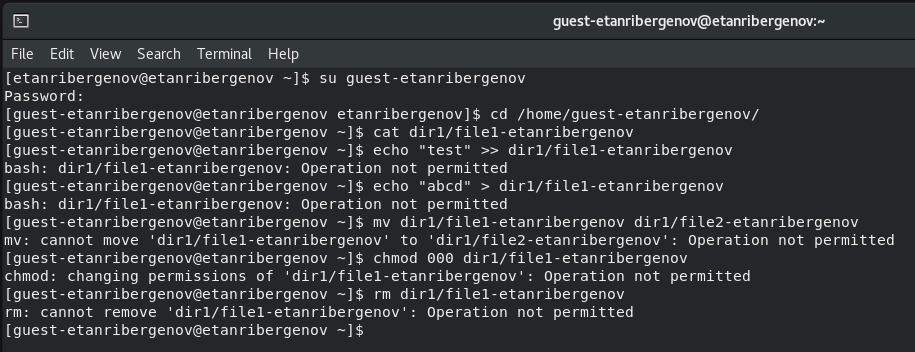

---
## Front matter
lang: ru-RU
title: Презентация по лабораторной работе №4
subtitle: Дискреционное разграничение прав в Linux. Расширенные атрибуты
author:
  - Танрибергенов Э.
institute:
  - Российский университет дружбы народов, Москва, Россия
date: 2024 г.

## i18n babel
babel-lang: russian
babel-otherlangs: english
## Fonts
mainfont: IBM Plex Serif
romanfont: IBM Plex Serif
sansfont: IBM Plex Sans
monofont: IBM Plex Mono
mathfont: STIX Two Math
mainfontoptions: Ligatures=Common,Ligatures=TeX,Scale=0.94
romanfontoptions: Ligatures=Common,Ligatures=TeX,Scale=0.94
sansfontoptions: Ligatures=Common,Ligatures=TeX,Scale=MatchLowercase,Scale=0.94
monofontoptions: Scale=MatchLowercase,Scale=0.94,FakeStretch=0.9
## Formatting pdf
toc: false
toc-title: Содержание
slide_level: 2
aspectratio: 169
section-titles: true
theme: metropolis
header-includes:
 - \metroset{progressbar=frametitle,sectionpage=progressbar,numbering=fraction}
---

# Информация

## Докладчик

  - Танрибергенов Эльдар
  - студент 4 курса из группы НПИбд-02-21
  - ФМиЕН, кафедра прикладной информатики и теории вероятностей
  - Российский университет дружбы народов

# Цели и задачи

## Цель работы

 Получение практических навыков работы в консоли с расширенными атрибутами файлов.

## Задачи

- Изменить расширенные атрибуты командой *lsattr*;
- Проверить их действие.

# Результаты

## Изменение расширенных атрибутов

- Определение расширенных атрибутов файла */home/guest-etanribergenov/dir1/file1-etanribergenov* от имени пользователя *guest-etanribergenov*
- команда: ***lsattr \<file\>***

{#fig:001}

## Изменение расширенных атрибутов

- Установка на файл *file1-etanribergenov* прав, разрешающих чтение и запись для владельца файла
- команда: ***chmod 600 \<file\>***

{#fig:002}

## Изменение расширенных атрибутов

- Установка на файл расширенного атрибута *«a»* от имени пользователя *guest-etanribergenov*
- команда:  ***chattr +a /home/guest-etanribergenov/dir1/file1-etanribergenov***

{#fig:003}

## Изменение расширенных атрибутов

- Установка расширенного атрибута *«a»* на файл от имени суперпользователя
- команда: ***chattr +a \<file\>***
- команда ***sudo su*** повышает права пользователя

{#fig:004}

## Изменение расширенных атрибутов

- Проверка правильности установления атрибута от имени пользователя *guest-etanribergenov*
- команда: ***lsattr /home/guest-etanribergenov/dir1/file1-etanribergenov***

{#fig:005}

## Изменение расширенных атрибутов

- Выполнение дозаписи в файл *file1-etanribergenov* слова «test»
- команда ***echo "test" >> \<file\>***

{#fig:006}

## Изменение расширенных атрибутов

- Проверка выполнения дозаписи в файл
- команда ***cat \<file\>***

{#fig:007}

## Изменение расширенных атрибутов

- Попытка совершения различных операций над файлом с расширенным атрибутом *«a»*

{#fig:008}

## Изменение расширенных атрибутов

- Замена атрибута *«a»* атрибутом *«i»*

{#fig:009}

## Изменение расширенных атрибутов

- Попытка совершения различных операций над файлом с расширенным атрибутом *«i»*

{#fig:010 height=65% width=65%}

# Вывод
  
## Вывод

 В результате выполнения работы я повысил свои навыки использования интерфейса командой строки (CLI), познакомился на примерах с тем, как используются основные и расширенные атрибуты при разграничении доступа. Имел возможность связать теорию дискреционного разделения доступа с её реализацией на практике в ОС Linux. Опробовал действие на практике расширенных атрибутов «а» и «i».