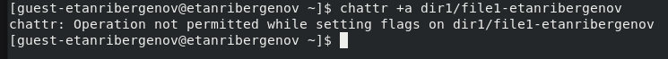
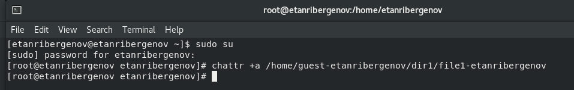
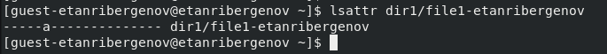
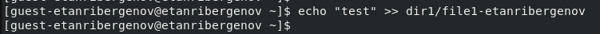

---
## Front matter
title: "Отчёт по лабораторной работе №4"
subtitle: "Дисциплина: Информационная безопасность"
author: "Выполнил: Танрибергенов Эльдар"

## Generic otions
lang: ru-RU
toc-title: "Содержание"

## Bibliography
bibliography: bib/cite.bib
csl: pandoc/csl/gost-r-7-0-5-2008-numeric.csl

## Pdf output format
toc: true # Table of contents
toc-depth: 2
lof: true # List of figures
lot: false # List of tables
fontsize: 12pt
linestretch: 1.5
papersize: a4
documentclass: scrreprt
## I18n polyglossia
polyglossia-lang:
  name: russian
  options:
	- spelling=modern
	- babelshorthands=true
polyglossia-otherlangs:
  name: english
## I18n babel
babel-lang: russian
babel-otherlangs: english
## Fonts
mainfont: IBM Plex Serif
romanfont: IBM Plex Serif
sansfont: IBM Plex Sans
monofont: IBM Plex Mono
mathfont: STIX Two Math
mainfontoptions: Ligatures=Common,Ligatures=TeX,Scale=0.94
romanfontoptions: Ligatures=Common,Ligatures=TeX,Scale=0.94
sansfontoptions: Ligatures=Common,Ligatures=TeX,Scale=MatchLowercase,Scale=0.94
monofontoptions: Scale=MatchLowercase,Scale=0.94,FakeStretch=0.9
mathfontoptions:
## Biblatex
biblatex: true
biblio-style: "gost-numeric"
biblatexoptions:
  - parentracker=true
  - backend=biber
  - hyperref=auto
  - language=auto
  - autolang=other*
  - citestyle=gost-numeric
## Pandoc-crossref LaTeX customization
figureTitle: "Рис."
tableTitle: "Таблица"
listingTitle: "Листинг"
lofTitle: "Список иллюстраций"
lotTitle: "Список таблиц"
lolTitle: "Листинги"
## Misc options
indent: true
header-includes:
  - \usepackage{indentfirst}
  - \usepackage{float} # keep figures where there are in the text
  - \floatplacement{figure}{H} # keep figures where there are in the text
---

# Цель работы

 Получение практических навыков работы в консоли с расширенными атрибутами файлов.

# Задания

 1. Изменить расширенные атрибуты командой *lsattr* и проверить их действие.

# Выполнение лабораторной работы

1. Изменение расширенных атрибутов

1.1. От имени пользователя *guest-etanribergenov* определил расширенные атрибуты файла */home/guest-etanribergenov/dir1/file1-etanribergenov* командой

`lsattr /home/guest-etanribergenov/dir1/file1-etanribergenov`

{#fig:001}

1.2. Установил на файл *file1-etanribergenov* права, разрешающие чтение и запись для владельца файла командами 

`cd /home/guest-etanribergenov`

`chmod 600 dir1-etanribergenov/file1-etanribergenov`

{#fig:002}

1.3. Попробовал установить на файл */home/guest-etanribergenov/dir1/file1-etanribergenov* расширенный атрибут a от имени пользователя *guest-etanribergenov*:

`chattr +a /home/guest-etanribergenov/dir1/file1-etanribergenov`

В ответ получил отказ от выполнения операции.

{#fig:003}

1.4. Зашёл на третью консоль с правами администратора. Попробовал установить расширенный атрибут *«a»* на файл */home/guest-etanribergenov/dir1/file1-etanribergenov* от имени суперпользователя:

`chattr +a /home/guest-etanribergenov/dir1/file1-etanribergenov`

{#fig:004}

1.5. От пользователя *guest-etanribergenov* проверил правильность установления атрибута:

`lsattr /home/guest-etanribergenov/dir1/file1-etanribergenov`

{#fig:005}

1.6 Выполнил дозапись в файл *file1-etanribergenov* слова «test» командой

`echo "test" >> /home/guest-etanribergenov/dir1/file1-etanribergenov`

{#fig:006}

После этого выполнил чтение файла *file1-etanribergenov* командой

`cat /home/guest-etanribergenov/dir1/file1-etanribergenov`

Убедился, что слово test было успешно записано в *file1-etanribergenov*.

{#fig:007}

1.7. Попробовал стереть имеющуюся в файле информацию командой

`echo "abcd" > /home/guest-etanribergenov/dirl/file1-etanribergenov`

Попробовал переименовать и удалить файл. А также попробовал изменить атрибуты файла - неуспешно. Операции не разрешены.

{#fig:008}

1.8. Снял расширенный атрибут *«a»* с файла */home/guest-etanribergenov/dirl/file1-etanribergenov* от имени суперпользователя командой

`chattr -a /home/guest-etanribergenov/dir1/file1-etanribergenov`

{#fig:009}

Повторил операции, которые ранее не удавалось выполнить - успешно.

{#fig:010}

Аттрибут *«a»* команды *chattr* позволяет лишь дозаписать в файл.

{#fig:011}

1.9. Повторил действия по шагам, заменив атрибут *«a»* атрибутом *«i»*.

{#fig:012}

В этот раз не удалось даже дозаписать в файл.

{#fig:013}

Аттрибут *«i»* команды *chattr* не позволяет какие-либо действия с файлом.

{#fig:014}

# Выводы

 В результате выполнения работы я повысил свои навыки использования интерфейса командой строки (CLI), познакомился на примерах с тем, как используются основные и расширенные атрибуты при разграничении доступа. Имел возможность связать теорию дискреционного разделения доступа с её реализацией на практике в ОС Linux. Опробовал действие на практике расширенных атрибутов «а» и «i».

