---
## Front matter
lang: ru-RU
title: Презентация по лабораторной работе №5
subtitle: Дискреционное разграничение прав в Linux. Исследование влияния дополнительных атрибутов
author:
  - Танрибергенов Э.
institute:
  - Российский университет дружбы народов, Москва, Россия
date: 2024 г.

## i18n babel
babel-lang: russian
babel-otherlangs: english
## Fonts
mainfont: IBM Plex Serif
romanfont: IBM Plex Serif
sansfont: IBM Plex Sans
monofont: IBM Plex Mono
mathfont: STIX Two Math
mainfontoptions: Ligatures=Common,Ligatures=TeX,Scale=0.94
romanfontoptions: Ligatures=Common,Ligatures=TeX,Scale=0.94
sansfontoptions: Ligatures=Common,Ligatures=TeX,Scale=MatchLowercase,Scale=0.94
monofontoptions: Scale=MatchLowercase,Scale=0.94,FakeStretch=0.9
## Formatting pdf
toc: false
toc-title: Содержание
slide_level: 2
aspectratio: 169
section-titles: true
theme: metropolis
header-includes:
 - \metroset{progressbar=frametitle,sectionpage=progressbar,numbering=fraction}
---

# Информация

## Докладчик

  - Танрибергенов Эльдар
  - студент 4 курса из группы НПИбд-02-21
  - ФМиЕН, кафедра прикладной информатики и теории вероятностей
  - Российский университет дружбы народов

# Цели и задачи

## Цель работы

 Изучение механизмов изменения идентификаторов, применения *SetUID*- и *Sticky*-битов. Получение практических навыков работы в консоли с дополнительными атрибутами. Рассмотрение работы механизма смены идентификатора процессов пользователей, а также влияние бита *Sticky* на запись и удаление файлов.

## Задачи

 - Исследовать *SetUID*- и *SetGID*-биты;
 - Исследовать *Sticky*-бит.
  

# Результаты

## Исследование *SetUID*- и *SetGID*-битов

- Программа выводит *UID* и *GID* владельца файла
- Программа написана на *C*

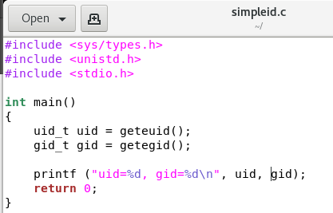{#fig:001}

## Исследование *SetUID*- и *SetGID*-битов

- команда ***gcc \<file.c\>***

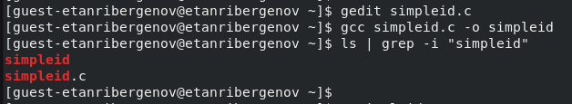{#fig:002}

## Исследование *SetUID*- и *SetGID*-битов

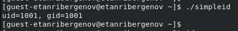{#fig:003}

## Исследование *SetUID*- и *SetGID*-битов

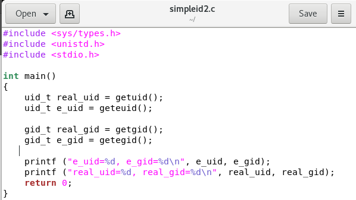{#fig:004}

## Исследование *SetUID*- и *SetGID*-битов

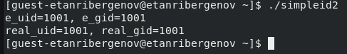{#fig:005}

## Исследование *SetUID*- и *SetGID*-битов

- ***chown*** - меняет владельца файла/директории
- ***chmod*** - меняет атрибуты файла/директории
- ***u+s*** - устанавливает SetUID на файл/директорию

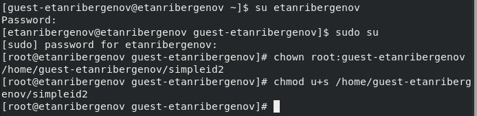{#fig:006}

## Исследование *SetUID*- и *SetGID*-битов

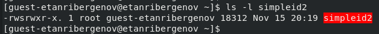{#fig:007}

## Исследование *SetUID*- и *SetGID*-битов

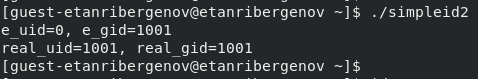{#fig:008}

## Исследование *SetUID*- и *SetGID*-битов

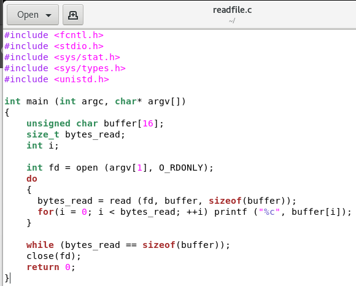{#fig:009 width=70% height=70%}

## Исследование *SetUID*- и *SetGID*-битов

- ***chown*** - меняет владельца файла/директории
- ***chmod*** - меняет атрибуты файла/директории

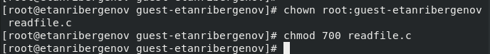{#fig:010}

## Исследование *SetUID*- и *SetGID*-битов

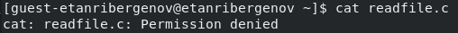{#fig:011}

## Исследование *SetUID*- и *SetGID*-битов

- ***chown*** - меняет владельца файла/директории
- ***chmod*** - меняет атрибуты файла/директории
- ***u+s*** - устанавливает SetUID на файл/директорию
  
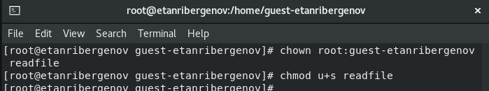{#fig:012}

## Исследование *SetUID*- и *SetGID*-битов

- Программа читает этот файл, т.к. инициатор (владелец) программы - суперпользователь *root*

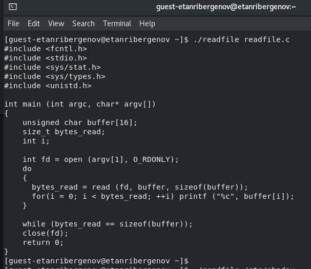{#fig:013 width=70% height=70%}

## Исследование *SetUID*- и *SetGID*-битов

- Программа читает этот файл, т.к. инициатор (владелец) программы - суперпользователь *root*

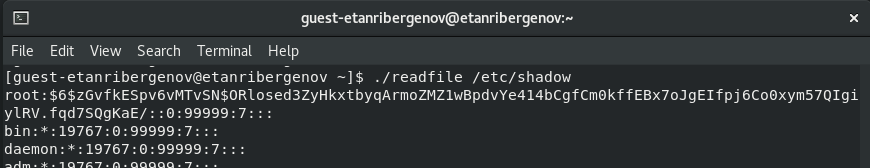{#fig:014}

## Исследование *Sticky*-бита

- ***"t"*** в атрибутах файла/директории говорит о наличии *Sticky*-бита

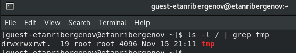{#fig:015}

## Исследование *Sticky*-бита

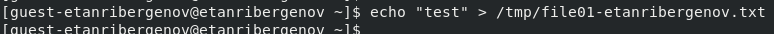{#fig:016}

## Исследование *Sticky*-бита

- ***chmod*** - меняет атрибуты файла/директории
- ***"o+"*** - задаёт права доступа для категории пользователей *"все остальные"*

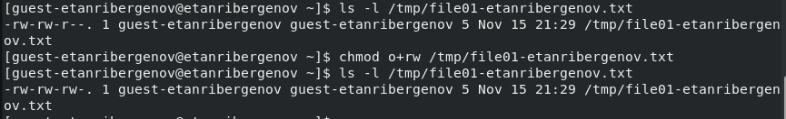{#fig:017}

## Исследование *Sticky*-бита

- ***su \<user\>*** - вход в систему от имени пользователя *user*

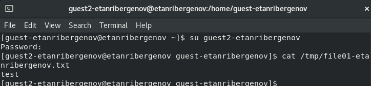{#fig:018}

## Исследование *Sticky*-бита

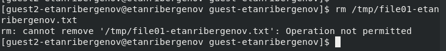{#fig:019}

## Исследование *Sticky*-бита

- ***chmod*** - меняет атрибуты файла/директории
- ***-t*** - убирает Sticky-бит из атрибутов файла/директории

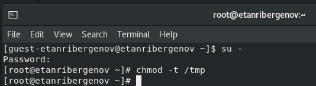{#fig:020}

## Исследование *Sticky*-бита

- Удаление возможно после снятия атрибута ***t***

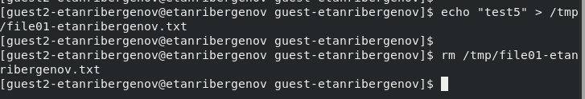{#fig:021}

# Вывод
  
## Вывод

  В результате выполнения работы я изучил механизмы изменения идентификаторов, применения *SetUID*- и *Sticky*-битов. Получил практические навыки работы в консоли с дополнительными атрибутами. Рассмотрел работы механизма смены идентификатора процессов пользователей, а также влияние бита *Sticky* на запись и удаление файлов.