---
## Front matter
title: "Отчёт по лабораторной работе №5"
subtitle: "Дисциплина: Информационная безопасность"
author: "Выполнил: Танрибергенов Эльдар"

## Generic otions
lang: ru-RU
toc-title: "Содержание"

## Bibliography
bibliography: bib/cite.bib
csl: pandoc/csl/gost-r-7-0-5-2008-numeric.csl

## Pdf output format
toc: true # Table of contents
toc-depth: 2
lof: true # List of figures
lot: false # List of tables
fontsize: 12pt
linestretch: 1.5
papersize: a4
documentclass: scrreprt
## I18n polyglossia
polyglossia-lang:
  name: russian
  options:
	- spelling=modern
	- babelshorthands=true
polyglossia-otherlangs:
  name: english
## I18n babel
babel-lang: russian
babel-otherlangs: english
## Fonts
mainfont: IBM Plex Serif
romanfont: IBM Plex Serif
sansfont: IBM Plex Sans
monofont: IBM Plex Mono
mathfont: STIX Two Math
mainfontoptions: Ligatures=Common,Ligatures=TeX,Scale=0.94
romanfontoptions: Ligatures=Common,Ligatures=TeX,Scale=0.94
sansfontoptions: Ligatures=Common,Ligatures=TeX,Scale=MatchLowercase,Scale=0.94
monofontoptions: Scale=MatchLowercase,Scale=0.94,FakeStretch=0.9
mathfontoptions:
## Biblatex
biblatex: true
biblio-style: "gost-numeric"
biblatexoptions:
  - parentracker=true
  - backend=biber
  - hyperref=auto
  - language=auto
  - autolang=other*
  - citestyle=gost-numeric
## Pandoc-crossref LaTeX customization
figureTitle: "Рис."
tableTitle: "Таблица"
listingTitle: "Листинг"
lofTitle: "Список иллюстраций"
lotTitle: "Список таблиц"
lolTitle: "Листинги"
## Misc options
indent: true
header-includes:
  - \usepackage{indentfirst}
  - \usepackage{float} # keep figures where there are in the text
  - \floatplacement{figure}{H} # keep figures where there are in the text
---

# Цель работы

 Изучение механизмов изменения идентификаторов, применения *SetUID*- и *Sticky*-битов. Получение практических навыков работы в консоли с дополнительными атрибутами. Рассмотрение работы механизма смены идентификатора процессов пользователей, а также влияние бита *Sticky* на запись и удаление файлов.

# Задания

 1. Исследовать *SetUID*- и *SetGID*-биты.
 2. Исследовать *Sticky*-бит.


# Указания к работе

Подготовка лабораторного стенда. Помимо прав администратора для выполнения части заданий потребуются средства разработки приложений. В частности, при подготовке стенда следует убедиться, что в системе установлен компилятор *gcc*. Так как программы с установленным битом *SetUID* могут представлять большую брешь в системе безопасности, в современных системах используются дополнительные механизмы защиты. Проследите, чтобы система защиты *SELinux* не мешала выполнению заданий работы. Отключите систему запретов до очередной перезагрузки системы командой *setenforce 0*. После этого команда *getenforce* должна выводить *Permissive*.

{#fig:001}


# Выполнение лабораторной работы


1. Исследование *SetUID* и *SetGID*-битов

1.1. Вошёл в систему от имени пользователя *guest-etanribergenov*.

1.2. Создал программу *simpleid.c*

{#fig:002}

1.3. Скомплилировал программу и убедился, что файл программы создан
   
`gcc simpleid.c -o simpleid`

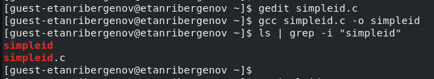{#fig:003}


1.4. Выполнил программу *simpleid*:

`./simpleid`

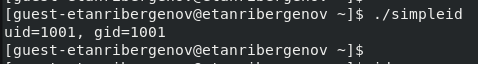{#fig:004}


1.5. Выполнил системную программу *id*:

{#fig:005}

Выведенные данные совпадают.


1.6. Усложнил программу, добавив вывод действительных идентификаторов, получившуюся программу назвал *simpleid2.c* :

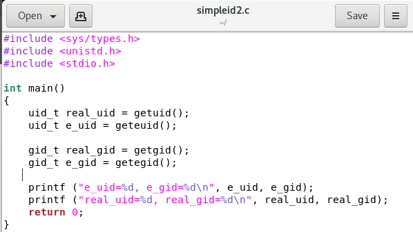{#fig:006}


1.7. Скомпилируйте и запустите *simpleid2.c*:
   
`gcc simpleid2.c -o simpleid2`

`./simpleid2`

{#fig:007}

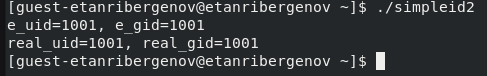{#fig:008}


1.8. От имени суперпользователя выполните команды:

`chown root:guest-etanribergenov /home/guest-etanribergenov/simpleid2`

`chmod u+s /home/guest-etanribergenov/simpleid2`

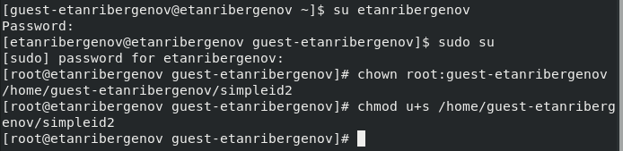{#fig:009}


1.9. Использовал *sudo su*, чтобы повысить права пользователя до прав суперпользователя.


1.10. Выполнил проверку правильности установки новых атрибутов и смены владельца файла *simpleid2*:

`ls -l simpleid2`

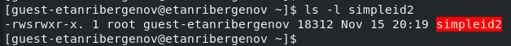{#fig:010}


1.11. Запустил *simpleid2* и *id*:

`./simpleid2`

`id`

{#fig:011}

{#fig:012}

Значение *e_uid* стало 0, в то время, как настоящий идентификатор *uid* и *uid* из программы *id* вывели 1001. 


1.12.  Проделал тоже самое относительно *SetGID*-бита.

{#fig:013}

{#fig:014}


1.13.  Создал программу *readfile.c*

{#fig:015}


1.14. Откомпилировал её.
  
`gcc readfile.c -o readfile`

{#fig:016}


1.15. Сменил владельца у файла *readfile.c* и изменил права так, чтобы только суперпользователь (*root*) мог прочитать его, a *guest-etanribergenov* не мог.

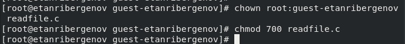{#fig:017}


1.16. Проверил, что пользователь *guest-etanribergenov* не может прочитать файл *readfile.c*.

{#fig:018}


1.17. Сменил у программы *readfile* владельца и установил *SetUID*-бит.

{#fig:019}


1.18. Проверил, может ли программа *readfile* прочитать файл *readfile.c* - может.

{#fig:020}


1.19. Проверил, может ли программа *readfile* прочитать файл */etc/shadow* - может.

Это возможно потому, что пользователем программы стал суперпользователь (*root*).

{#fig:021}


2. Исследование Sticky-бита

2.1. Выяснил, установлен ли атрибут *Sticky* на директории */tmp*, для чего выполнил команду

`ls -l / | grep tmp`

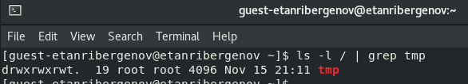{#fig:022}


2.2. От имени пользователя *guest-etanribergenov* создал файл *file01-etanribergenov.txt* в директории */tmp* со словом test:

`echo "test" > /tmp/file01-etanribergenov.txt`

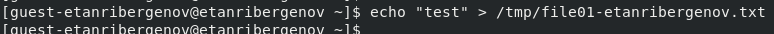{#fig:023}


2.3. Просмотрел атрибуты у только что созданного файла и разрешил чтение и запись для категории пользователей «все остальные»:

`ls -l /tmp/file01-etanribergenov.txt`

`chmod o+rw /tmp/file01-etanribergenov.txt`

`ls -l /tmp/file01-etanribergenov.txt`

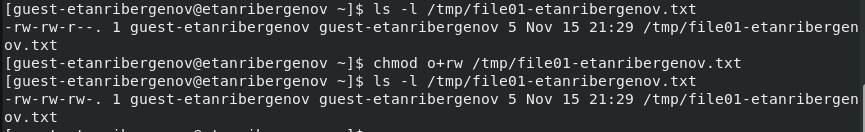{#fig:024}


2.4. От пользователя *guest2-etanribergenov* (не являющегося владельцем) попробуйте прочитать файл */tmp/file01-etanribergenov.txt*:

`cat /tmp/file01-etanribergenov.txt`

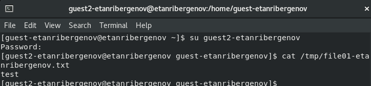{#fig:025}


2.5. От пользователя *guest2-etanribergenov* попробуйте дозаписать в файл */tmp/file01-etanribergenov.txt* слово «test2» командой

`echo "test2" > /tmp/file01-etanribergenov.txt`

{#fig:026}

Удалось выполнить операцию.


2.6. Проверил содержимое файла командой

`cat /tmp/file01-etanribergenov.txt`

{#fig:027}


2.7. От пользователя *guest2-etanribergenov* попробуйте записать в файл */tmp/file01-etanribergenov.txt* слово «test3», стерев при этом всю имеющуюся в файле информацию командой

`echo "test3" > /tmp/file01-etanribergenov.txt`

{#fig:028}

Удалось выполнить операцию.


2.8. Проверил содержимое файла командой

`cat /tmp/file01-etanribergenov.txt`

{#fig:029}


2.9. От пользователя *guest2-etanribergenov* попробуйте удалить файл */tmp/file01-etanribergenov.txt* командой

`rm /tmp/fileOl-etanribergenov.txt`

Не удалось удалить файл.

{#fig:030}


2.10. Повысил свои права до суперпользователя следующей командой

`su -`

и выполнил после этого команду, снимающую атрибут *t* (Sticky-бит) с директории */tmp*:

`chmod -t /tmp`

{#fig:031}


2.11. Покинул режим суперпользователя командой 

`exit`

{#fig:032}


2.12. От пользователя *guest2-etanribergenov* проверил, что атрибута *t* у директории */tmp* нет:

`ls -l / | grep tmp`

{#fig:033}


2.13. Повторил предыдущие шаги. Изменений нет - файл всё также можно дополнить и переписать.

2.14. Удалось удалить файл от имени пользователя, не являющегося его владельцем. Это случилось из-за того, что ранее был снят *Sticky*-бит с директории, защищавший файлы от неразрешённых действий.

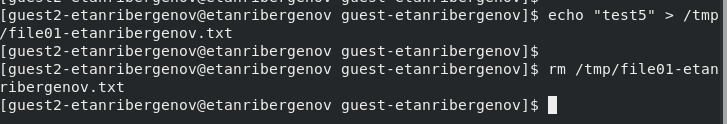{#fig:034}


2.15. Повысил свои права до суперпользователя и вернул атрибут *t* на директорию */tmp*:

```
su -
chmod +t /tmp
exit

```

{#fig:035}


# Выводы

 В результате выполнения работы я изучил механизмы изменения идентификаторов, применения *SetUID*- и *Sticky*-битов. Получил практические навыки работы в консоли с дополнительными атрибутами. Рассмотрел работы механизма смены идентификатора процессов пользователей, а также влияние бита *Sticky* на запись и удаление файлов.
