---
## Front matter
lang: ru-RU
title: Презентация по лабораторной работе №6
subtitle: Мандатное разграничение прав в Linux
author:
  - Танрибергенов Э.
institute:
  - Российский университет дружбы народов, Москва, Россия
date: 2024 г.

## i18n babel
babel-lang: russian
babel-otherlangs: english
## Fonts
mainfont: IBM Plex Serif
romanfont: IBM Plex Serif
sansfont: IBM Plex Sans
monofont: IBM Plex Mono
mathfont: STIX Two Math
mainfontoptions: Ligatures=Common,Ligatures=TeX,Scale=0.94
romanfontoptions: Ligatures=Common,Ligatures=TeX,Scale=0.94
sansfontoptions: Ligatures=Common,Ligatures=TeX,Scale=MatchLowercase,Scale=0.94
monofontoptions: Scale=MatchLowercase,Scale=0.94,FakeStretch=0.9
## Formatting pdf
toc: false
toc-title: Содержание
slide_level: 2
aspectratio: 169
section-titles: true
theme: metropolis
header-includes:
 - \metroset{progressbar=frametitle,sectionpage=progressbar,numbering=fraction}
---

# Информация

## Докладчик

  - Танрибергенов Эльдар
  - студент 4 курса из группы НПИбд-02-21
  - ФМиЕН, кафедра прикладной информатики и теории вероятностей
  - Российский университет дружбы народов

# Цели и задачи

## Цель работы

 Развить навыки администрирования ОС *Linux*. Получить первое практическое знакомство с технологией *SELinux*.
Проверить работу *SELinux* на практике совместно с веб-сервером *Apache*.

## Задачи

- Проверить работу *SELinux* на практике совместно с веб-сервером *Apache*

# Результаты

## Проверка работы *SELinux* на практике совместно с веб-сервером *Apache*

- команда ***getenforce***  -  выводит режим работы *SELinux*
- команда ***sestatus***  -  выводит статус *SELinux*

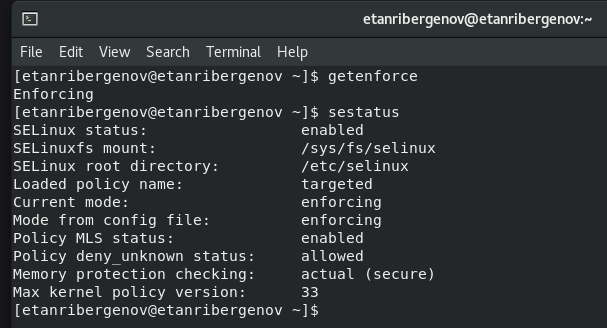{#fig:001 width=60% height=60%}

## Проверка работы *SELinux* на практике совместно с веб-сервером *Apache*

- команда  ***service httpd start***

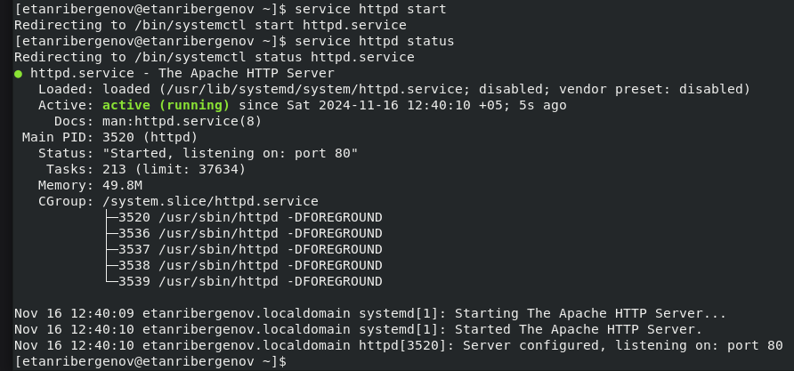{#fig:002 width=70% height=70%}

## Проверка работы *SELinux* на практике совместно с веб-сервером *Apache*

- команда ***ls -l var/www | grep html***
- только у суперпользователя есть разрешение на запись в директорию

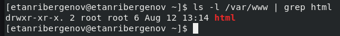{#fig:003}

## Проверка работы *SELinux* на практике совместно с веб-сервером *Apache*

- выполено в *Gedit*, свободном текстовом редакторе для среды *GNOME*

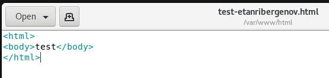{#fig:004} 

## Проверка работы *SELinux* на практике совместно с веб-сервером *Apache*

- команда ***ls -Z \<file\>***
- контекст, присваиваемый по умолчанию вновь созданным файлам в директории */var/www/html*  -  *httpd_sys_content_t*.

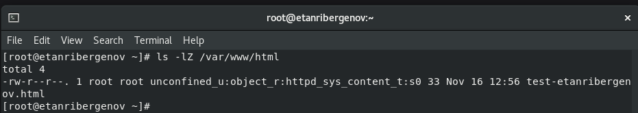{#fig:005}

## Проверка работы *SELinux* на практике совместно с веб-сервером *Apache*

- выполнено в веб-браузере *Firefox*

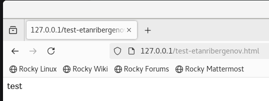{#fig:006}

## Проверка работы *SELinux* на практике совместно с веб-сервером *Apache*

- команда ***chcon -t \<контекст_безопасности\> \<файл\>*** - меняет контекст *SELinux* для файла
- ***ls -Z \<file\>*** - проверка контекста безопасности *SELinux*

{#fig:007}

## Проверка работы *SELinux* на практике совместно с веб-сервером *Apache*

- выполнено в веб-браузере *Firefox*

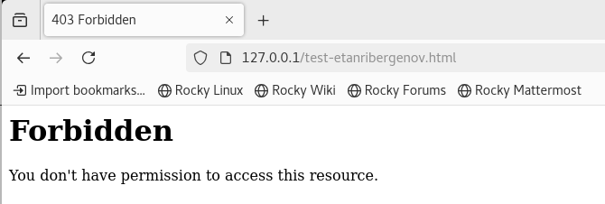{#fig:008}

## Проверка работы *SELinux* на практике совместно с веб-сервером *Apache*

- в файле конф. файле веб-сервера *Apache* */etc/httpd/httpd.conf* строка ***Listen 80*** заменена на ***Listen 81***

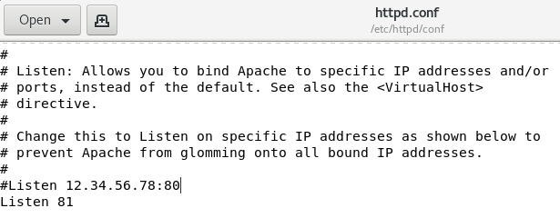{#fig:009}

## Проверка работы *SELinux* на практике совместно с веб-сервером *Apache*

- Сбой не произошёл

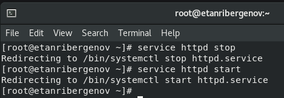{#fig:010}

## Проверка работы *SELinux* на практике совместно с веб-сервером *Apache*

- команда ***semanage port -a -t http_port_t -р tcp 81***

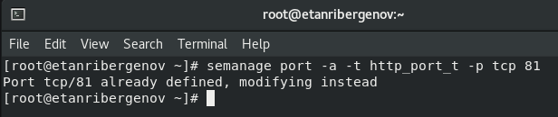{#fig:011}

## Проверка работы *SELinux* на практике совместно с веб-сервером *Apache*

- команда ***semanage port -l | grep http_port_t***

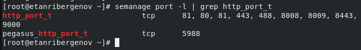{#fig:012}

## Проверка работы *SELinux* на практике совместно с веб-сервером *Apache*

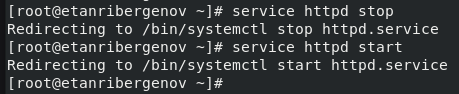{#fig:013}

## Проверка работы *SELinux* на практике совместно с веб-сервером *Apache*

- команда ***chcon -t \<контекст_безопасности\> \<файл\>*** 

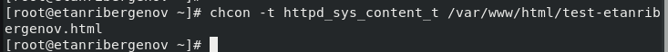{#fig:014}

## Проверка работы *SELinux* на практике совместно с веб-сервером *Apache*

- выполнено в веб-браузере *Firefox*

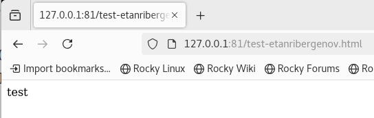{#fig:015}

# Вывод
  
## Вывод

 В результате выполнения работы я развил навыки администрирования ОС *Linux*. Получил первое практическое знакомство с технологией *SELinux*. Проверил работу *SELinux* на практике совместно с веб-сервером *Apache*.