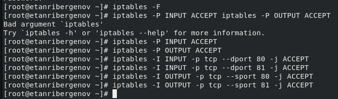
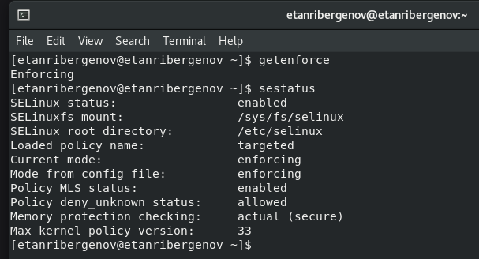
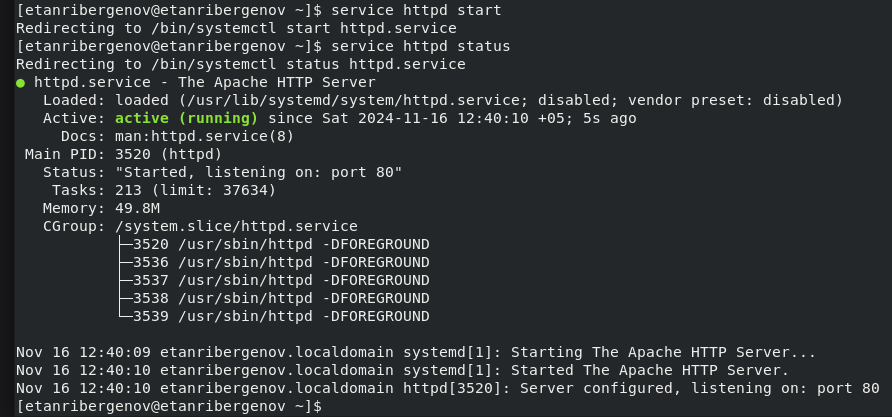
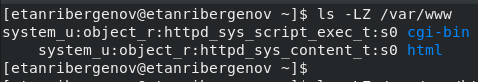
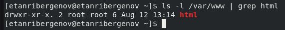
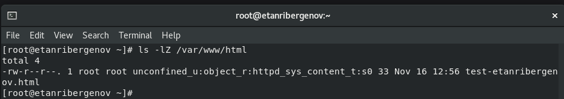
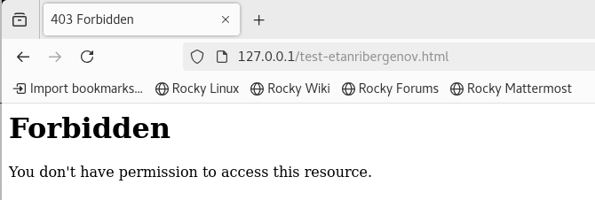
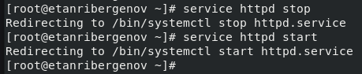
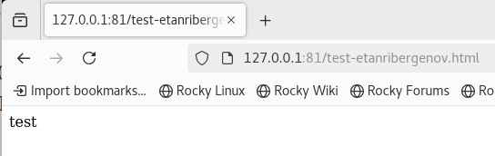

---
## Front matter
title: "Отчёт по лабораторной работе №6"
subtitle: "Дисциплина: Информационная безопасность"
author: "Выполнил: Танрибергенов Эльдар"

## Generic otions
lang: ru-RU
toc-title: "Содержание"

## Bibliography
bibliography: bib/cite.bib
csl: pandoc/csl/gost-r-7-0-5-2008-numeric.csl

## Pdf output format
toc: true # Table of contents
toc-depth: 2
lof: true # List of figures
lot: false # List of tables
fontsize: 12pt
linestretch: 1.5
papersize: a4
documentclass: scrreprt
## I18n polyglossia
polyglossia-lang:
  name: russian
  options:
	- spelling=modern
	- babelshorthands=true
polyglossia-otherlangs:
  name: english
## I18n babel
babel-lang: russian
babel-otherlangs: english
## Fonts
mainfont: IBM Plex Serif
romanfont: IBM Plex Serif
sansfont: IBM Plex Sans
monofont: IBM Plex Mono
mathfont: STIX Two Math
mainfontoptions: Ligatures=Common,Ligatures=TeX,Scale=0.94
romanfontoptions: Ligatures=Common,Ligatures=TeX,Scale=0.94
sansfontoptions: Ligatures=Common,Ligatures=TeX,Scale=MatchLowercase,Scale=0.94
monofontoptions: Scale=MatchLowercase,Scale=0.94,FakeStretch=0.9
mathfontoptions:
## Biblatex
biblatex: true
biblio-style: "gost-numeric"
biblatexoptions:
  - parentracker=true
  - backend=biber
  - hyperref=auto
  - language=auto
  - autolang=other*
  - citestyle=gost-numeric
## Pandoc-crossref LaTeX customization
figureTitle: "Рис."
tableTitle: "Таблица"
listingTitle: "Листинг"
lofTitle: "Список иллюстраций"
lotTitle: "Список таблиц"
lolTitle: "Листинги"
## Misc options
indent: true
header-includes:
  - \usepackage{indentfirst}
  - \usepackage{float} # keep figures where there are in the text
  - \floatplacement{figure}{H} # keep figures where there are in the text
---

# Цель работы

 Развить навыки администрирования ОС *Linux*. Получить первое практическое знакомство с технологией *SELinux*.
Проверить работу *SELinux* на практике совместно с веб-сервером *Apache*.

# Задания

- Выполнить указания к работе
- Проверить работу *SELinux* на практике совместно с веб-сервером *Apache*


# Указания к работе

Организация и описание лабораторного стенда. Для проведения указанной лабораторной работы на одно рабочее место требуется компьютер с установленной операционной системой *Linux*, поддерживающей технологию *SELinux*.
Предполагается использовать стандартный дистрибутив *Linux* *CentOS* с включённой политикой *SELinux* *targeted* и режимом *enforcing*. Для выполнения заданий требуется наличие учётной записи администратора (*root*) и учётной записи обычного пользователя. Постоянно работать от учётной записи *root* неправильно с точки зрения безопасности.
Подготовка лабораторного стенда и методические рекомендации.
При подготовке стенда обратите внимание, что необходимая для работы и указанная выше политика *targeted* и режим *enforcing* используются в данном дистрибутиве по умолчанию, т.е. каких-то специальных настроек не требуется. При этом следует убедиться, что политика и режим включены, особенно когда работа будет проводиться повторно и велика вероятность изменений при предыдущем использовании системы. При необходимости администратор должен разбираться в работе *SELinux* и уметь как исправить конфигурационный файл */etc/selinux/config*, так и проверить используемый режим и политику.
Необходимо, чтобы был установлен веб-сервер *Apache*.

{#fig:001}

{#fig:002}

В конфигурационном файле */etc/httpd/conf/httpd.conf* необходимо задать параметр *ServerName*:

`ServerName test.ru`

{#fig:003}

чтобы при запуске веб-сервера не выдавались лишние сообщения об ошибках, не относящихся к лабораторной работе.
Также необходимо проследить, чтобы пакетный фильтр был отключён или в своей рабочей конфигурации позволял подключаться к 80-у и 81-у портам протокола tcp. Отключить фильтр можно командами

```
iptables -F
iptables -P INPUT ACCEPT iptables -P OUTPUT ACCEPT
```

либо добавить разрешающие правила:

```
iptables -I INPUT -p tcp --dport 80 -j ACCEPT
iptables -I INPUT -p tcp --dport 81 -j ACCEPT
iptables -I OUTPUT -p tcp --sport 80 -j ACCEPT
iptables -I OUTPUT -p tcp --sport 81 -j ACCEPT
```

{#fig:004}

Обратите внимание, что данные правила не являются «точными» и рекомендуемыми на все случаи жизни, они лишь позволяют правильно организовать работу стенда. В работе специально не делается акцент, каким браузером (или какой консольной программой) будет производиться подключение к веб-серверу. По желанию могут использоваться разные программы, такие как консольные *links*, *lynx*, *wget* и графические *konqueror*, *opera*, *firefox* или др.


# Выполнение работы

1. Вошёл в систему с полученными учётными данными и убедился, что *SELinux* работает в режиме *enforcing* политики *targeted* с помощью команд ***getenforce*** и ***sestatus***.

{#fig:005}


2. Обратился с помощью браузера к веб-серверу, запущенному на компьютере - неуспешно. Проверил статус веб-сервера - он не включен.
  
`service httpd status`

{#fig:006}

Запустил его.

`service httpd start`

{#fig:007}


3.  Нашёл веб-сервер *Apache* в списке процессов, определил его контекст безопасности - *httpd_t*.

`ps auxZ | grep httpd`

{#fig:008}


4. Посмотрел текущее состояние переключателей *SELinux* для *Apache* с помощью команды

`sestatus -b httpd`

{#fig:009}

Многие из них находятся в положении «off».


5. Посмотрел статистику по политике с помощью команды *seinfo*, также определил множество пользователей, ролей, типов.

{#fig:010}


6. Определил тип файлов и поддиректорий, находящихся в директории */var/www*, с помощью команды

`ls -lZ /var/www`

{#fig:011}


7. Определил тип файлов, находящихся в директории */var/www/html*:

`ls -lZ /var/www/html`

{#fig:012}


8. Определил круг пользователей, которым разрешено создание файлов в директории */var/www/html*.

`ls -l var/www | grep html`

{#fig:013}

Только у суперпользователя есть разрешение на запись в директорию.


9.  Создал от имени суперпользователя html-файл */var/www/html/test-etanribergenov.html* следующего содержания:

```
<html>
<body>test</body>
</html>
```

{#fig:014}


10.  Проверил контекст созданного файла. 

{#fig:015}

Контекст, присваиваемый по умолчанию вновь созданным файлам в директории */var/www/html*  -  *httpd_sys_content_t*.


11.  Обратился к файлу через веб-сервер, введя в браузере адрес http://127.0.0.1/test-etanribergenov.html. Убедился, что файл был успешно отображён.

{#fig:016}


12.  Изучил справку *man httpd_selinux* и выяснил, какие контексты файлов определены для httpd.

{#fig:017}
   

Сопоставил их с типом файла *test-etanribergenov.html*. Да, тип контекста этого файла есть в справке.

`ls -Z /var/www/html/test-etanribergenov.html`

{#fig:018}

Рассмотрим полученный контекст детально. Так как по умолчанию пользователи CentOS являются свободными от типа
(unconfined в переводе с англ. означает свободный), созданному файлу *test-etanribergenov.html* был сопоставлен *SELinux*, пользователь *unconfined_u*.
Это первая часть контекста. Далее политика ролевого разделения доступа RBAC используется процессами, но не файлами, поэтому роли не имеют никакого значения для файлов. Роль *object_r* используется по умолчанию для файлов на «постоянных» носителях и на сетевых файловых системах. Если активна политика MLS, то могут использоваться и другие роли, например, secadm_r. Данный случай мы рассматривать не будем, как и предназначение :s0.
Тип *httpd_sys_content_t* позволяет процессу *httpd* получить доступ к файлу. Благодаря наличию последнего типа мы получили доступ к файлу при обращении к нему через браузер.


13. Изменил контекст файла */var/www/html/test-etanribergenov.html* с *httpd_sys_content_t* на *samba_share_t*, к которому процесс *httpd* не имеет доступа. После этого проверил, что контекст поменялся.

```
chcon -t samba_share_t /var/www/html/test-etanribergenov.html
ls -Z /var/www/html/test-etanribergenov.html
```

{#fig:019}


14. Попробовал ещё раз получить доступ к файлу через веб-сервер, введя в браузере адрес http://127.0.0.1/test-etanribergenov.html. Получил сообщение об ошибке:

{#fig:020}


15. Файл не был отображён, несмотря на то, что права доступа позволяют читать этот файл любому пользователю, потому что контекст безопасности изменился и *httpd* больше не имеет доступа к файлу.

Просмотрел системный лог-файл:

`tail /var/log/messages`

{#fig:021}

Если в системе окажутся запущенными процессы *setroubleshootd* и *audtd*, то вы также сможете увидеть ошибки, аналогичные указанным выше, в файле */var/log/audit/audit.log*. 

{#fig:022}


16.  Попробовал запустить веб-сервер *Apache* на прослушивание ТСР-порта 81 (а не 80, как рекомендует *IANA* и прописано в */etc/services*). Для этого в файле */etc/httpd/httpd.conf* нашёл строчку ***Listen 80*** и заменил её на ***Listen 81***.

{#fig:023}


17.  Выполнил перезапуск веб-сервера *Apache*. Сбой не произошёл. Это потому, что в разделе подготовки лабораторного стенда были приведены команды, разрешающие веб-серверу *Apache* прослушивать *tcp* порт 81.
    
{#fig:024}


18. Проанализируйте лог-файлы:

`tail -nl /var/log/messages`

{#fig:025}

Просмотрите файлы */var/log/http/error_log*, */var/log/http/access_log* и */var/log/audit/audit.log* и выясните, в каких файлах появились записи.

{#fig:026}

{#fig:027}

Сообщений об ошибке нет.


19.  Выполнил команду

`semanage port -a -t http_port_t -р tcp 81`

{#fig:028}

После этого проверил список портов командой

`semanage port -l | grep http_port_t`

{#fig:029}

Убедился, что порт 81 появился в списке.


20.  Попробовал запустить веб-сервер *Apache* ещё раз. Он вновь запустился без проблем, как и в прошлый раз.

{#fig:030}


21. Вернул контекст *httpd_sys_cоntent__t* к файлу */var/www/html/test-etanribergenov.html*:

`chcon -t httpd_sys_content_t /var/www/html/test-etanribergenov.html`

{#fig:031}

После этого попробовал получить доступ к файлу через веб-сервер, введя в браузере адрес http://127.0.0.1:81/test-etanribergenov.html.
Увидел содержимое файла — слово «test».

{#fig:032}


22.  Исправил обратно конфигурационный файл *apache*, вернув ***Listen 80***.

{#fig:033}

23. Удалил привязку *http_port_t* к 81 порту и проверил, что порт 81 удалён.

```
semanage port -d -t http_port_t -p tcp 81
semanage port -l | grep http_port_t
```

{#fig:034}


24.  Удалил файл */var/www/html/test-etanribergenov.html*

`rm /var/www/html/test-etanribergenov.html`

{#fig:035}


# Выводы

 В результате выполнения работы я развил навыки администрирования ОС *Linux*. Получил первое практическое знакомство с технологией *SELinux*. Проверил работу *SELinux* на практике совместно с веб-сервером *Apache*.

