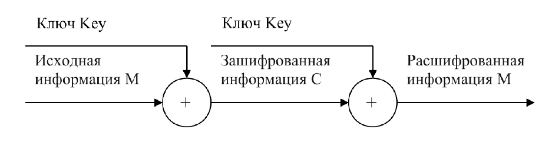
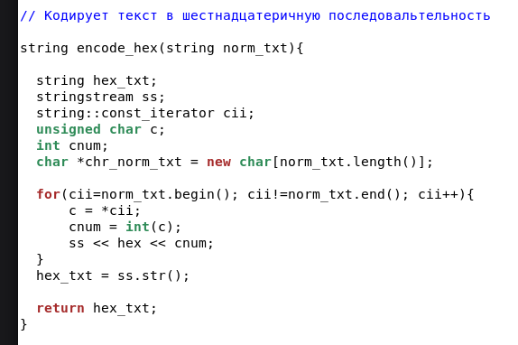
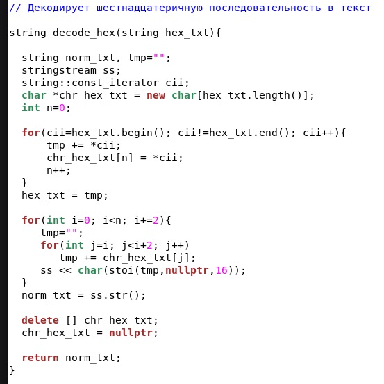
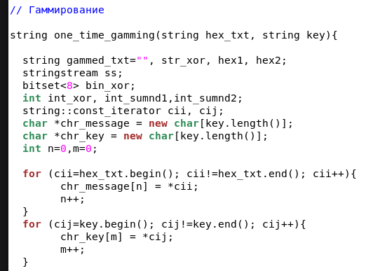
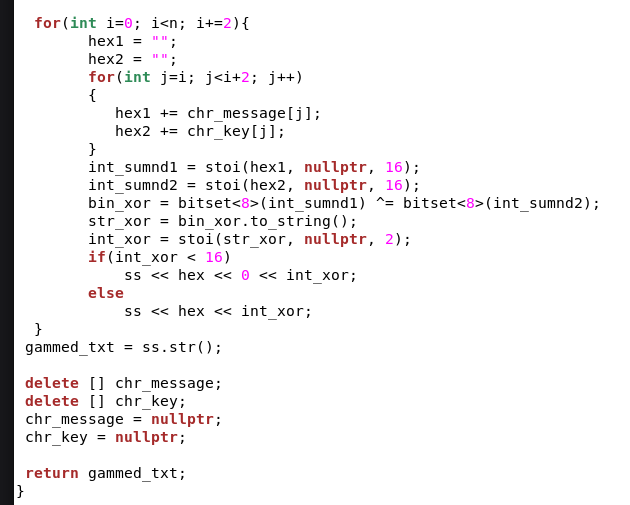
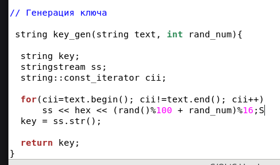
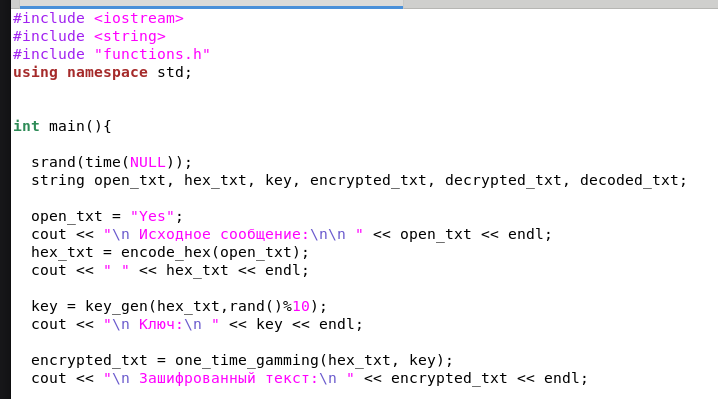
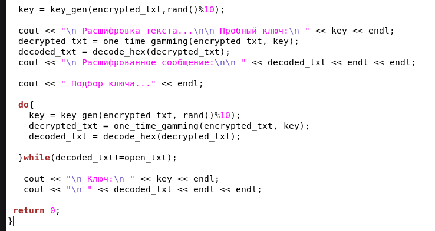
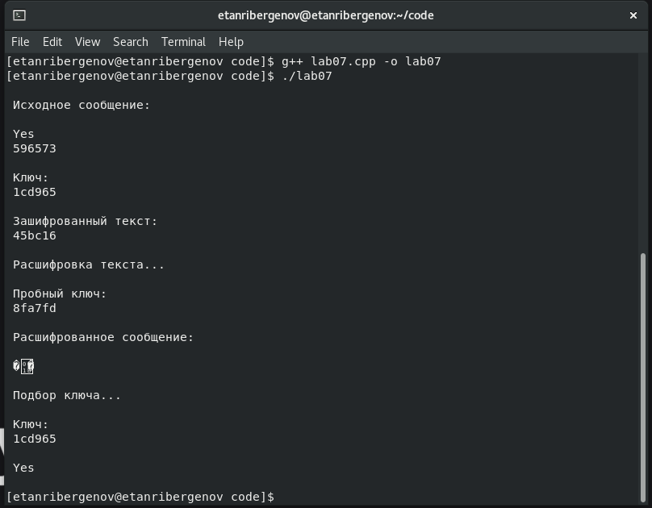

---
## Front matter
lang: ru-RU
title: Презентация по лабораторной работе №7
subtitle: Элементы криптографии. Однократное гаммирование
author:
  - Танрибергенов Э.
institute:
  - Российский университет дружбы народов, Москва, Россия
date: 2024 г.

## i18n babel
babel-lang: russian
babel-otherlangs: english
## Fonts
mainfont: IBM Plex Serif
romanfont: IBM Plex Serif
sansfont: IBM Plex Sans
monofont: IBM Plex Mono
mathfont: STIX Two Math
mainfontoptions: Ligatures=Common,Ligatures=TeX,Scale=0.94
romanfontoptions: Ligatures=Common,Ligatures=TeX,Scale=0.94
sansfontoptions: Ligatures=Common,Ligatures=TeX,Scale=MatchLowercase,Scale=0.94
monofontoptions: Scale=MatchLowercase,Scale=0.94,FakeStretch=0.9
## Formatting pdf
toc: false
toc-title: Содержание
slide_level: 2
aspectratio: 169
section-titles: true
theme: metropolis
header-includes:
 - \metroset{progressbar=frametitle,sectionpage=progressbar,numbering=fraction}
---

# Информация

## Докладчик

  - Танрибергенов Эльдар
  - студент 4 курса из группы НПИбд-02-21
  - ФМиЕН, кафедра прикладной информатики и теории вероятностей
  - Российский университет дружбы народов

# Цели и задачи

## Цель работы

Освоить на практике применение режима однократного гаммирования.

# Задания

- Требуется разработать приложение, позволяющее шифровать и дешифровать данные в режиме однократного гаммирования. Приложение должно:
1. Определить вид шифротекста при известном ключе и известном открытом тексте.
2. Определить ключ, с помощью которого шифротекст может быть преобразован в некоторый фрагмент текста, представляющий собой один из возможных вариантов прочтения открытого текста.

# Результаты

## Теоретические сведения

Предложенная Г. С. Вернамом так называемая «схема однократного использования (гаммирования)» является простой, но надёжной схе-
мой шифрования данных. Гаммирование представляет собой наложение (снятие) на открытые (зашифрованные) данные последовательности элементов других данных, полученной с помощью некоторого криптографического алгоритма, для получения зашифрованных (открытых) данных. Иными словами, наложение гаммы — это сложение её элементов с элементами открытого (закрытого) текста по некоторому фиксированному модулю, значение которого представляет собой известную часть алгоритма шифрования. В соответствии с теорией криптоанализа, если в методе шифрования используется однократная вероятностная гамма (однократное гаммирование) той же длины, что и подлежащий сокрытию текст, то текст нельзя раскрыть.

## Теоретические сведения

{#fig:001}

## Теоретические сведения

Необходимые и достаточные условия абсолютной стойкости шифра:
– полная случайность ключа;
– равенство длин ключа и открытого текста;
– однократное использование ключа.

## Написание программы

- Программа написана на языке программирования С++
- Написаны функции: кодирования в 16-ричный код, декодирования, гаммирования и генерации ключа
- Функции размещены в отдельном файле и подключаются при помощи *#include*

## Написание программы

{#fig:002 width=70% height=70%}

## Написание программы

{#fig:003 width=70% height=70%}

## Написание программы

{#fig:004 width=70% height=70%}

## Написание программы

{#fig:005 width=70% height=70%}

## Написание программы

{#fig:006 width=70% height=70%}

## Написание программы

{#fig:007 width=70% height=70%}

## Написание программы

{#fig:008 width=70% height=70%}

## Проверка работы

- В качестве открытого текста выбрано маленькое слово "Yes"

{#fig:009 width=70% height=70%}

# Вывод
  
## Вывод

 В результате выполнения работы я освоил на практике применение режима однократного гаммирования.