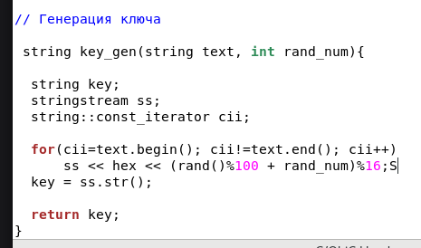
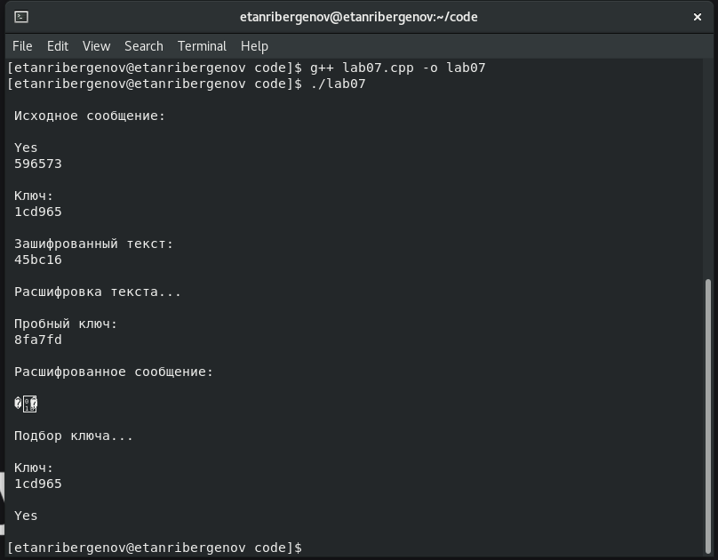

---
## Front matter
title: "Отчёт по лабораторной работе №7"
subtitle: "Дисциплина: Информационная безопасность"
author: "Выполнил: Танрибергенов Эльдар"

## Generic otions
lang: ru-RU
toc-title: "Содержание"

## Bibliography
bibliography: bib/cite.bib
csl: pandoc/csl/gost-r-7-0-5-2008-numeric.csl

## Pdf output format
toc: true # Table of contents
toc-depth: 2
lof: true # List of figures
lot: false # List of tables
fontsize: 12pt
linestretch: 1.5
papersize: a4
documentclass: scrreprt
## I18n polyglossia
polyglossia-lang:
  name: russian
  options:
	- spelling=modern
	- babelshorthands=true
polyglossia-otherlangs:
  name: english
## I18n babel
babel-lang: russian
babel-otherlangs: english
## Fonts
mainfont: IBM Plex Serif
romanfont: IBM Plex Serif
sansfont: IBM Plex Sans
monofont: IBM Plex Mono
mathfont: STIX Two Math
mainfontoptions: Ligatures=Common,Ligatures=TeX,Scale=0.94
romanfontoptions: Ligatures=Common,Ligatures=TeX,Scale=0.94
sansfontoptions: Ligatures=Common,Ligatures=TeX,Scale=MatchLowercase,Scale=0.94
monofontoptions: Scale=MatchLowercase,Scale=0.94,FakeStretch=0.9
mathfontoptions:
## Biblatex
biblatex: true
biblio-style: "gost-numeric"
biblatexoptions:
  - parentracker=true
  - backend=biber
  - hyperref=auto
  - language=auto
  - autolang=other*
  - citestyle=gost-numeric
## Pandoc-crossref LaTeX customization
figureTitle: "Рис."
tableTitle: "Таблица"
listingTitle: "Листинг"
lofTitle: "Список иллюстраций"
lotTitle: "Список таблиц"
lolTitle: "Листинги"
## Misc options
indent: true
header-includes:
  - \usepackage{indentfirst}
  - \usepackage{float} # keep figures where there are in the text
  - \floatplacement{figure}{H} # keep figures where there are in the text
---

# Цель работы

 Освоить на практике применение режима однократного гаммирования.

# Задания

- Требуется разработать приложение, позволяющее шифровать и дешифровать данные в режиме однократного гаммирования. Приложение должно:
1. Определить вид шифротекста при известном ключе и известном открытом тексте.
2. Определить ключ, с помощью которого шифротекст может быть преобразован в некоторый фрагмент текста, представляющий собой один из возможных вариантов прочтения открытого текста.

# Теоретические сведения

Предложенная Г. С. Вернамом так называемая «схема однократного использования (гаммирования)» является простой, но надёжной схе-
мой шифрования данных. Гаммирование представляет собой наложение (снятие) на открытые (зашифрованные) данные последовательности элементов других данных, полученной с помощью некоторого криптографического алгоритма, для получения зашифрованных (открытых) данных. Иными словами, наложение гаммы — это сложение её элементов с элементами открытого (закрытого) текста по некоторому фиксированному модулю, значение которого представляет собой известную часть алгоритма шифрования.
В соответствии с теорией криптоанализа, если в методе шифрования используется однократная вероятностная гамма (однократное гаммирование) той же длины, что и подлежащий сокрытию текст, то текст нельзя раскрыть.
Даже при раскрытии части последовательности гаммы нельзя получить информацию о всём скрываемом тексте.
Наложение гаммы по сути представляет собой выполнение операции сложения по модулю 2 (XOR) между элементами гаммы и элементами подлежащего сокрытию текста. Такой метод шифрования является симметричным, так как двойное при-
бавление одной и той же величины по модулю 2 восстанавливает исходное значение, а шифрование и расшифрование выполняется одной и той же программой. Открытый текст имеет символьный вид, а ключ — шестнадцатеричное представление. Ключ также можно представить в символьном виде, воспользовавшись таблицей ASCII-кодов.
К. Шеннон доказал абсолютную стойкость шифра в случае, когда однократно используемый ключ, длиной, равной длине исходного сообщения, является фрагментом истинно случайной двоичной последовательности с равномерным законом распределения. Криптоалгоритм не даёт никакой информации об открытом тексте: при известном зашифрованном сообщении C все различные ключевые последовательности K возможны и равновероятны, а значит, возможны и любые сообщения P.
Необходимые и достаточные условия абсолютной стойкости шифра:
– полная случайность ключа;
– равенство длин ключа и открытого текста;
– однократное использование ключа.

# Выполнение работы

Программа написана на языке программирования С++

{#fig:001}

В цикле посимвольно разбирается строка. Конвертируется в целочисленный вид, а далее - в шестнадцатеричный. После 16-ричные числа записываются в строковый поток. Полученная строка возвращается функцией.

{#fig:002}

У меня не получилось нормально работать с классом строк С++, поэтому я скопировал значения строки в массив символов. Далее по 2 символа (16-ричное число) превращал в целое число и добавлял в строковый поток их конвертированное в символ значение.
Далее функция возвращает получившуюся строку.

{#fig:003}

Здесь в символьные массивы занесены данные строк. 

{#fig:004}

А здесь уже происходит суммирование по модулю 2: 16-ричное число превращается в 10-чное, затем 10-чное число превращается в двоичную последовательность bitset, и после этого двоичные значения проходят операцию xor. Далее значение вновь конвертируется в 10-чное и проходит проверку. Если меньше 16, то надо дописать 0, т.к. система этого не делает. После всего этого значение в 16-чном виде заносится в строковый поток. Функция возвращает полученную строку.

{#fig:005}

Здесь просто цикл до размера шифротекста, в котором в строковый поток добавляется случайное число от 0 до 15 в 16-ричном виде.
И строка возвращается функцией.

{#fig:006}

Это уже главная функция ("запускающая"). Здесь просто выводится на консоль сообщения и вызываются функции из отдельного файла.

{#fig:007}

Далее происходит подбор ключа: ключ генерируется до тех пор, пока, расшифрованная с его помощью строка, не будет равна исходному открытому тексту.

{#fig:008}

Результат работы программы. Выбрал короткое слово "Yes", потому что иначе подбор происходит очень долго.

# Выводы

 В результате выполнения работы я освоил на практике применение режима однократного гаммирования.

# Ответы на контрольные вопросы

1. Однократное гаммирование - это суммирование по модулю 2 16-ричных последовательностей.
2. Необходимость иметь большие объёмы данных для использования в качестве гаммы. Угроза криптоанализа. Защита может быть нарушена, если злоумышленник получит достаточно большое количество зашифрованных сообщений и соответствующих ключевых потоков гаммы. Неустойчивость к ошибкам передачи данных. Для этого метода необходимы дополнительные механизмы проверки целостности и коррекции ошибок. Уязвимость к повторному использованию гаммы. Если гамма будет повторно использована, то система станет уязвимой, и её защита будет нарушена.
3. Высокая степень защиты от криптоанализа методом подбора ключа. Возможность обрабатывать данные любой длины. 
Отсутствие расширения сообщения. Неразличимость шифрованного текста с исходным. Если гамма является случайной и используется только один раз, то шифрованный текст будет неразличим с исходным текстом без знания ключа.
4. Потому что должен быть выделен одинаковый объём памяти.
5. В однократном гаммировании используется операция сложения по модулю 2 (XOR).
6. Сложить по модулю 2 байты (гаммировать).
7. Выполнить гаммирование открытого текста и шифротекста.
8. Полная случайность ключа; равенство длин ключа и открытого текста; однократное использование ключа.
