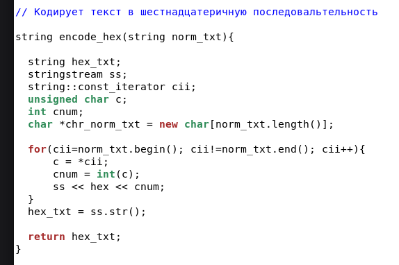
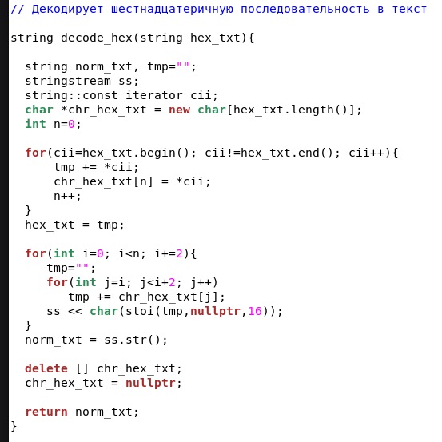
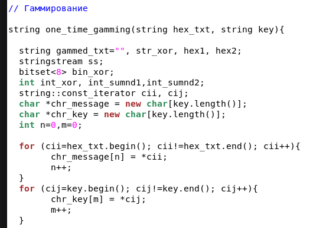
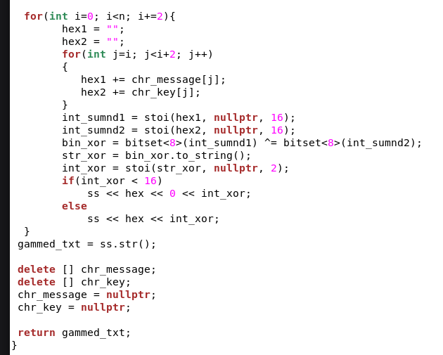
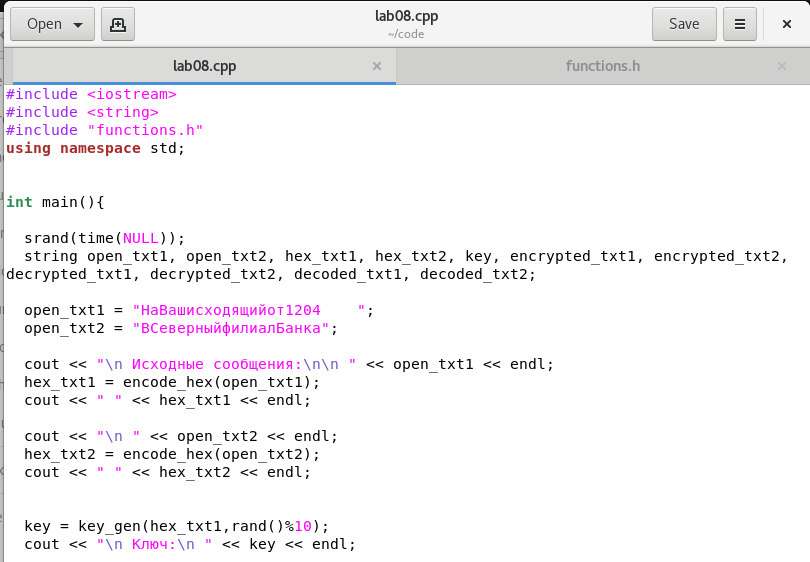
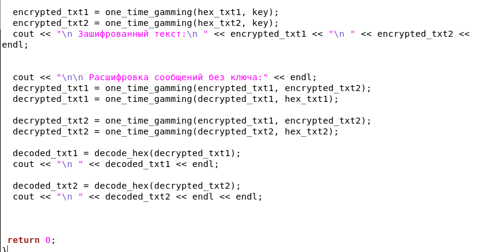
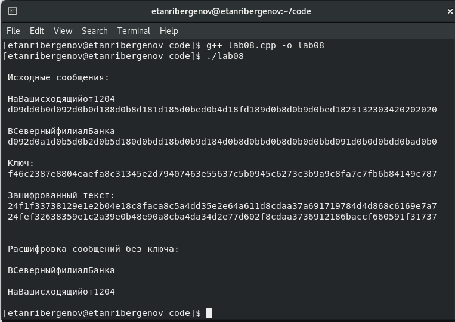

---
## Front matter
lang: ru-RU
title: Презентация по лабораторной работе №8
subtitle: Элементы криптографии. Шифрование (кодирование) различных исходных текстов одним ключом
author:
  - Танрибергенов Э.
institute:
  - Российский университет дружбы народов, Москва, Россия
date: 2024 г.

## i18n babel
babel-lang: russian
babel-otherlangs: english
## Fonts
mainfont: IBM Plex Serif
romanfont: IBM Plex Serif
sansfont: IBM Plex Sans
monofont: IBM Plex Mono
mathfont: STIX Two Math
mainfontoptions: Ligatures=Common,Ligatures=TeX,Scale=0.94
romanfontoptions: Ligatures=Common,Ligatures=TeX,Scale=0.94
sansfontoptions: Ligatures=Common,Ligatures=TeX,Scale=MatchLowercase,Scale=0.94
monofontoptions: Scale=MatchLowercase,Scale=0.94,FakeStretch=0.9
## Formatting pdf
toc: false
toc-title: Содержание
slide_level: 2
aspectratio: 169
section-titles: true
theme: metropolis
header-includes:
 - \metroset{progressbar=frametitle,sectionpage=progressbar,numbering=fraction}
---

# Информация

## Докладчик

  - Танрибергенов Эльдар
  - студент 4 курса из группы НПИбд-02-21
  - ФМиЕН, кафедра прикладной информатики и теории вероятностей
  - Российский университет дружбы народов

# Цели и задачи

## Цель работы

Освоить на практике применение режима однократного гаммирования на примере кодирования различных исходных текстов одним ключом.

# Задания

- Два текста кодируются одним ключом (однократное гаммирование). Требуется не зная ключа и не стремясь его определить, прочитать оба текста.

# Указания к работе

Исходные данные.

Две телеграммы Центра:

P1 = НаВашисходящийот1204

P2 = ВСеверныйфилиалБанка

# Результаты

## Написание программы

- Программа написана на языке программирования С++
- Написаны функции: кодирования в 16-ричный код, декодирования, гаммирования и генерации ключа
- Функции размещены в отдельном файле и подключаются при помощи *#include*

## Написание программы

{#fig:001 width=70% height=70%}

## Написание программы

{#fig:002 width=70% height=70%}

## Написание программы

{#fig:003 width=70% height=70%}

## Написание программы

{#fig:004 width=70% height=70%}

## Написание программы

{#fig:006 width=70% height=70%}

## Написание программы

{#fig:007 width=70% height=70%}

## Проверка работы

{#fig:008 width=70% height=70%}

# Вывод
  
## Вывод

 В результате выполнения работы я освоил на практике применение режима однократного гаммирования.