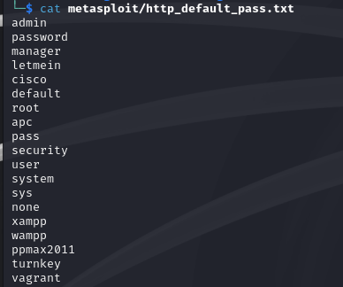

---
## Front matter
lang: ru-RU
title: Презентация по 3 этапу индивидуального проекта
subtitle: Использование Hydra
author:
  - Танрибергенов Э.
institute:
  - Российский университет дружбы народов, Москва, Россия
date: 2024 г.

## i18n babel
babel-lang: russian
babel-otherlangs: english
## Fonts
mainfont: IBM Plex Serif
romanfont: IBM Plex Serif
sansfont: IBM Plex Sans
monofont: IBM Plex Mono
mathfont: STIX Two Math
mainfontoptions: Ligatures=Common,Ligatures=TeX,Scale=0.94
romanfontoptions: Ligatures=Common,Ligatures=TeX,Scale=0.94
sansfontoptions: Ligatures=Common,Ligatures=TeX,Scale=MatchLowercase,Scale=0.94
monofontoptions: Scale=MatchLowercase,Scale=0.94,FakeStretch=0.9
## Formatting pdf
toc: false
toc-title: Содержание
slide_level: 2
aspectratio: 169
section-titles: true
theme: metropolis
header-includes:
 - \metroset{progressbar=frametitle,sectionpage=progressbar,numbering=fraction}
---

# Информация

## Докладчик

  - Танрибергенов Эльдар
  - студент 4 курса из группы НПИбд-02-21
  - ФМиЕН, кафедра прикладной информатики и теории вероятностей
  - Российский университет дружбы народов

# Цели и задачи

## Цель работы

 Ознакомиться с утилитой Hydra в Kali Linux и испытать. 

## Задачи

- Ознакомиться с утилитой Hydra в Kali Linux и испытать.

# Результаты

## Установка испытательной ВМ

 - ***Metasploitable*** - специальная нарочно очень уязвимая для всякого рода атак виртуальная машина

{#fig:001 widht=70% height=70%}

## Подготовка к испытанию Hydra

- команда ***ifconfig*** - выводит конфигурации всех сетевых интерфейсов

{#fig:002 widht=70% height=70%}

## Подготовка к испытанию Hydra

- ***nmap***  -  инструмент, который сканирует порты на рабочих станциях и серверах

{#fig:003}

## Подготовка к испытанию Hydra

{#fig:004 widht=70% height=70%}

## Испытание Hydra

 - Запуск hydra на поиск пароля по известному логину. Получен пароль: password.

{#fig:005 widht=70% height=70%}

# Вывод
  
## Вывод

 В результате выполнения работы я познакомился с утилитой для подбора имён пользователей (логинов) и паролей Hydra.