---
## Front matter
lang: ru-RU
title: Презентация по 5 этапу индивидуального проекта
subtitle: Использование Burp Suite
author:
  - Танрибергенов Э.
institute:
  - Российский университет дружбы народов, Москва, Россия
date: 2024 г.

## i18n babel
babel-lang: russian
babel-otherlangs: english
## Fonts
mainfont: IBM Plex Serif
romanfont: IBM Plex Serif
sansfont: IBM Plex Sans
monofont: IBM Plex Mono
mathfont: STIX Two Math
mainfontoptions: Ligatures=Common,Ligatures=TeX,Scale=0.94
romanfontoptions: Ligatures=Common,Ligatures=TeX,Scale=0.94
sansfontoptions: Ligatures=Common,Ligatures=TeX,Scale=MatchLowercase,Scale=0.94
monofontoptions: Scale=MatchLowercase,Scale=0.94,FakeStretch=0.9
## Formatting pdf
toc: false
toc-title: Содержание
slide_level: 2
aspectratio: 169
section-titles: true
theme: metropolis
header-includes:
 - \metroset{progressbar=frametitle,sectionpage=progressbar,numbering=fraction}
---

# Информация

## Докладчик

  - Танрибергенов Эльдар
  - студент 4 курса из группы НПИбд-02-21
  - ФМиЕН, кафедра прикладной информатики и теории вероятностей
  - Российский университет дружбы народов

# Цели и задачи

## Цель работы

Ознакомиться с утилитой Burpe Suite в Kali Linux и испытать. 

## Задачи

- Ознакомиться с утилитой Burpe Suite в Kali Linux и испытать. 

# Результаты

## Предварительные сведения

***Burp Suite*** представляет собой набор мощных инструментов безопасности веб-приложений, которые демонстрируют реальные возможности злоумышленника, проникающего в веб-приложения.

Произвёл SQL-инъекции в DVWA при помощи Burp Suite.

## SQL-инъекции в DVWA при помощи Burp Suite

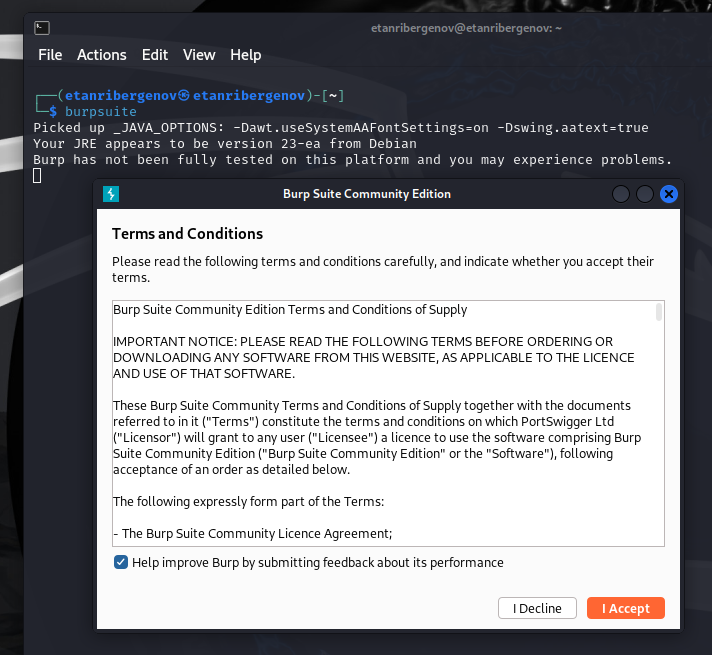{#fig:001 widht=70% height=70%}

## SQL-инъекции в DVWA при помощи Burp Suite

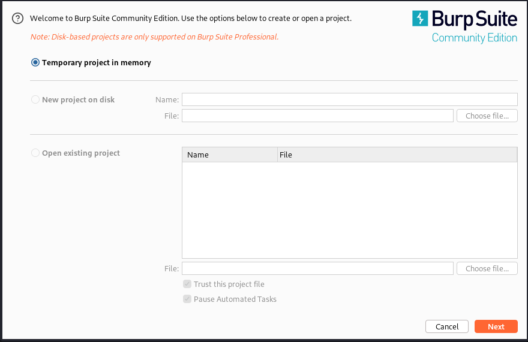{#fig:002 widht=70% height=70%}

## SQL-инъекции в DVWA при помощи Burp Suite

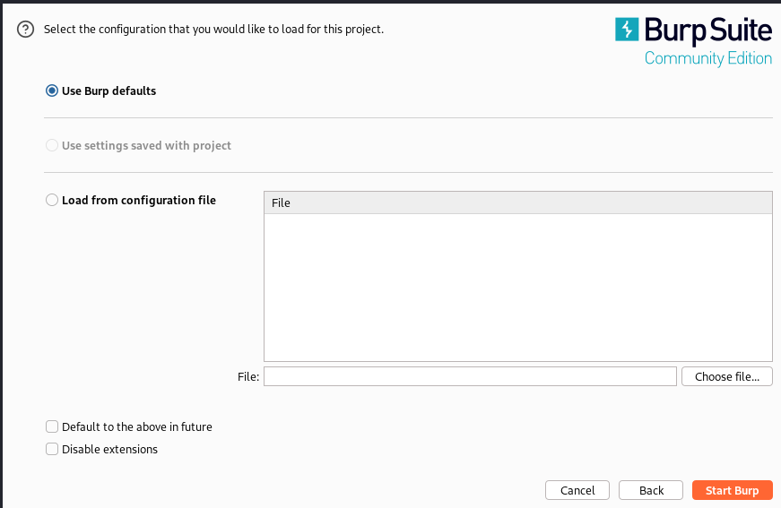{#fig:003 widht=70% height=70%}

## SQL-инъекции в DVWA при помощи Burp Suite

{#fig:004 widht=70% height=70%}

## SQL-инъекции в DVWA при помощи Burp Suite

{#fig:005 widht=70% height=70%}

## SQL-инъекции в DVWA при помощи Burp Suite

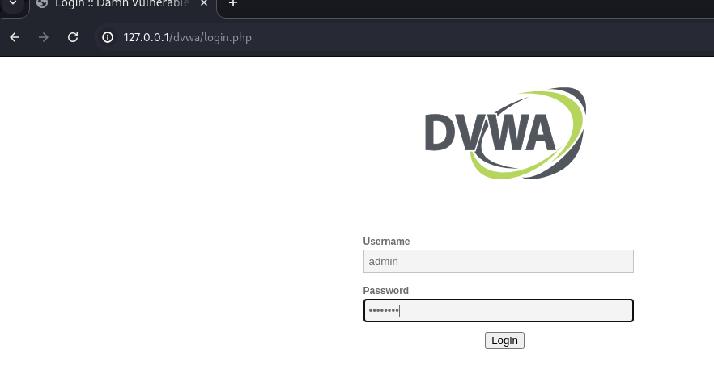{#fig:006 widht=70% height=70%}

## SQL-инъекции в DVWA при помощи Burp Suite

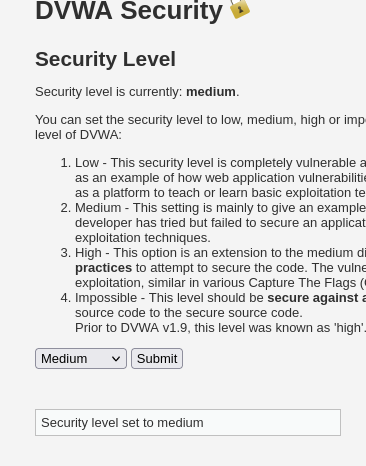{#fig:007 widht=70% height=70%}

## SQL-инъекции в DVWA при помощи Burp Suite

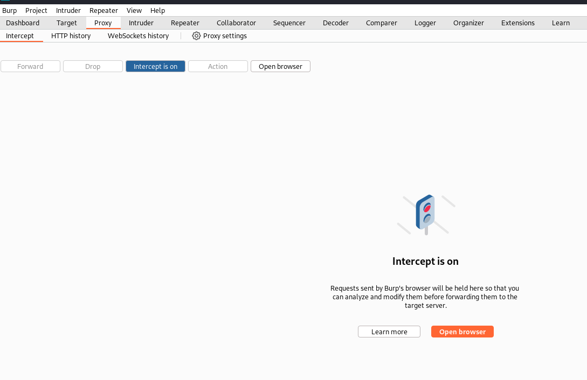{#fig:008 widht=70% height=70%}

## SQL-инъекции в DVWA при помощи Burp Suite

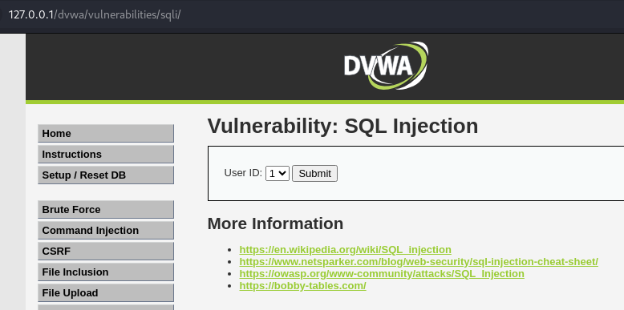{#fig:009 widht=70% height=70%}

## SQL-инъекции в DVWA при помощи Burp Suite

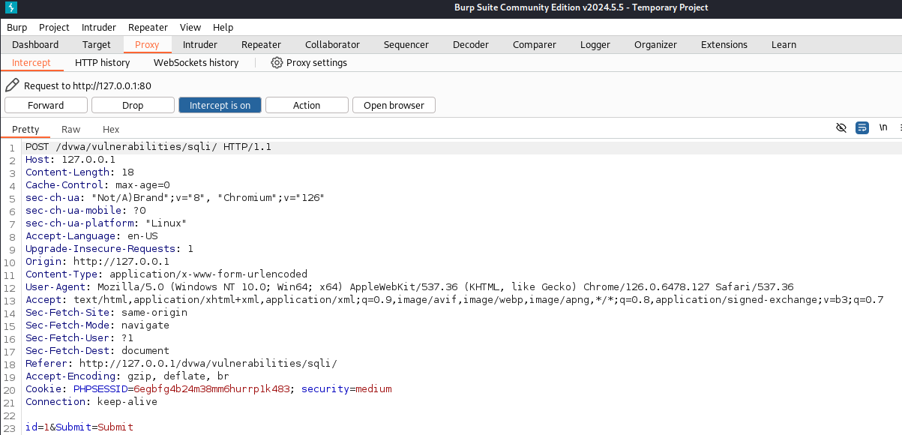{#fig:010 widht=70% height=70%}

## SQL-инъекции в DVWA при помощи Burp Suite

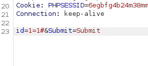{#fig:011 widht=70% height=70%}

## SQL-инъекции в DVWA при помощи Burp Suite

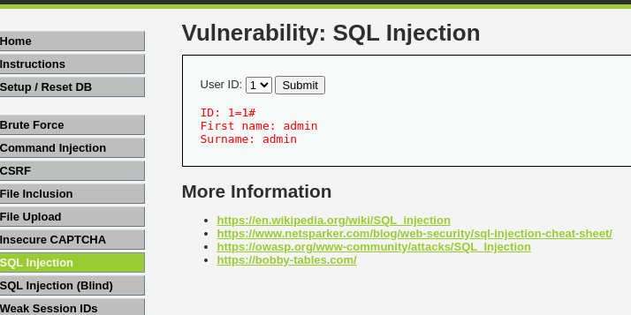{#fig:012 widht=70% height=70%}

## SQL-инъекции в DVWA при помощи Burp Suite

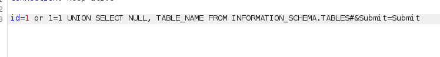{#fig:013 widht=70% height=70%}

## SQL-инъекции в DVWA при помощи Burp Suite

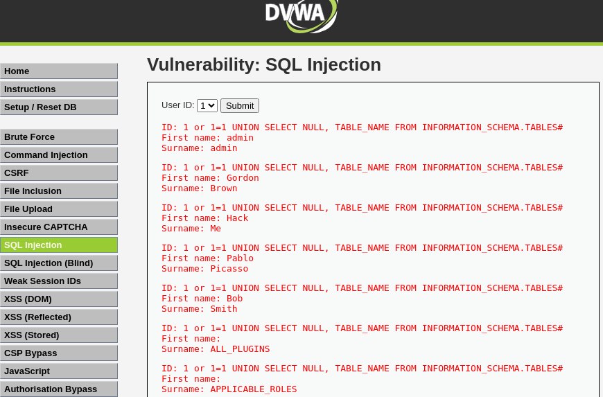{#fig:014 widht=70% height=70%}

## SQL-инъекции в DVWA при помощи Burp Suite

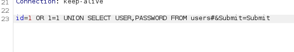{#fig:015 widht=70% height=70%}

## SQL-инъекции в DVWA при помощи Burp Suite

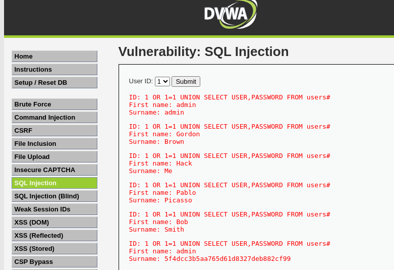{#fig:016 widht=70% height=70%}

# Вывод
  
## Вывод

 В результате выполнения работы я познакомился с инструментом тестирования уязвимостей веб-приложений - Burpe Suite.