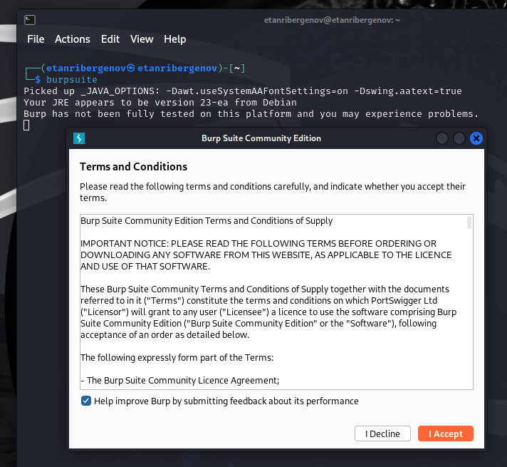
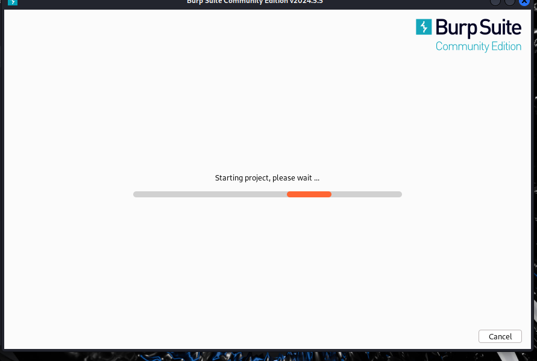
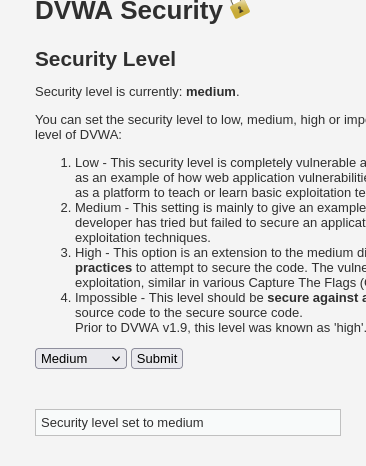
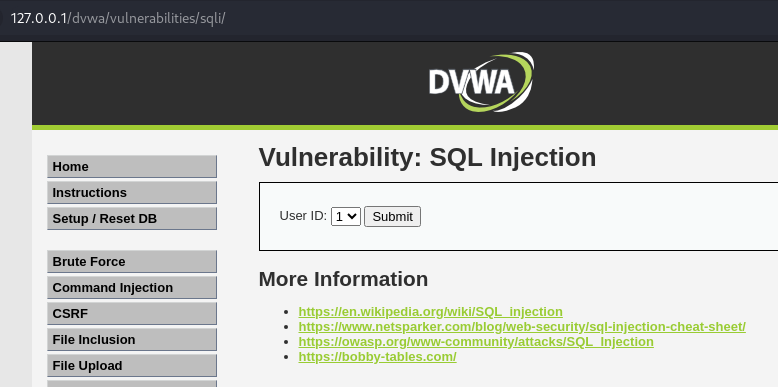
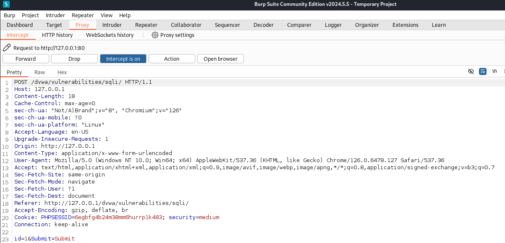

---
## Front matter
title: "Отчёт по 5-му этапу индивидуального проекта"
subtitle: "Дисциплина: Информационная безопасность"
author: "Выполнил: Танрибергенов Эльдар"

## Generic otions
lang: ru-RU
toc-title: "Содержание"

## Bibliography
bibliography: bib/cite.bib
csl: pandoc/csl/gost-r-7-0-5-2008-numeric.csl

## Pdf output format
toc: true # Table of contents
toc-depth: 2
lof: true # List of figures
lot: false # List of tables
fontsize: 12pt
linestretch: 1.5
papersize: a4
documentclass: scrreprt
## I18n polyglossia
polyglossia-lang:
  name: russian
  options:
	- spelling=modern
	- babelshorthands=true
polyglossia-otherlangs:
  name: english
## I18n babel
babel-lang: russian
babel-otherlangs: english
## Fonts
mainfont: IBM Plex Serif
romanfont: IBM Plex Serif
sansfont: IBM Plex Sans
monofont: IBM Plex Mono
mathfont: STIX Two Math
mainfontoptions: Ligatures=Common,Ligatures=TeX,Scale=0.94
romanfontoptions: Ligatures=Common,Ligatures=TeX,Scale=0.94
sansfontoptions: Ligatures=Common,Ligatures=TeX,Scale=MatchLowercase,Scale=0.94
monofontoptions: Scale=MatchLowercase,Scale=0.94,FakeStretch=0.9
mathfontoptions:
## Biblatex
biblatex: true
biblio-style: "gost-numeric"
biblatexoptions:
  - parentracker=true
  - backend=biber
  - hyperref=auto
  - language=auto
  - autolang=other*
  - citestyle=gost-numeric
## Pandoc-crossref LaTeX customization
figureTitle: "Рис."
tableTitle: "Таблица"
listingTitle: "Листинг"
lofTitle: "Список иллюстраций"
lotTitle: "Список таблиц"
lolTitle: "Листинги"
## Misc options
indent: true
header-includes:
  - \usepackage{indentfirst}
  - \usepackage{float} # keep figures where there are in the text
  - \floatplacement{figure}{H} # keep figures where there are in the text
---

# Цель работы

 Ознакомиться с утилитой Burpe Suite в Kali Linux и испытать. 

# Задания

- Ознакомиться с утилитой Burpe Suite в Kali Linux и испытать.

# Ход работы

***Burp Suite*** представляет собой набор мощных инструментов безопасности веб-приложений, которые демонстрируют реальные возможности злоумышленника, проникающего в веб-приложения.

Произвёл SQL-инъекции в DVWA при помощи Burp Suite.

{#fig:001}

{#fig:002}

{#fig:003}

{#fig:004}

{#fig:005}

{#fig:006}

{#fig:007}

{#fig:008}

{#fig:009}

{#fig:010}

{#fig:011}

{#fig:012}

{#fig:013}

{#fig:014}

{#fig:015}

{#fig:016}

# Выводы

 В результате выполнения работы я познакомился с инструментом тестирования уязвимостей веб-приложений - Burpe Suite.

